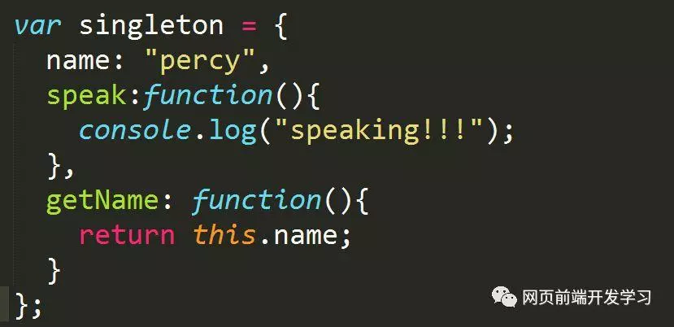
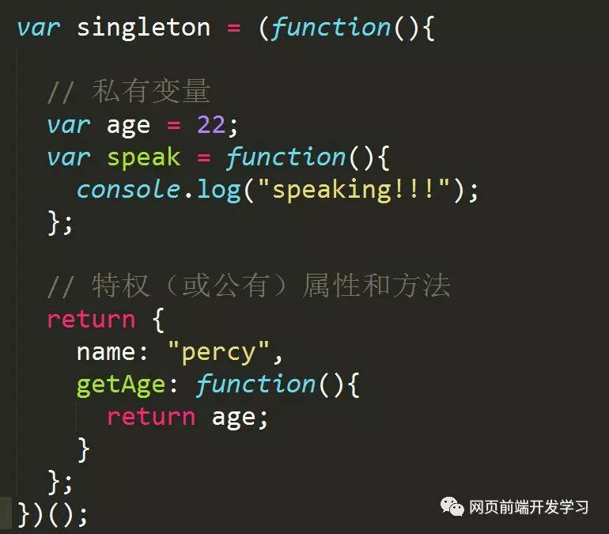
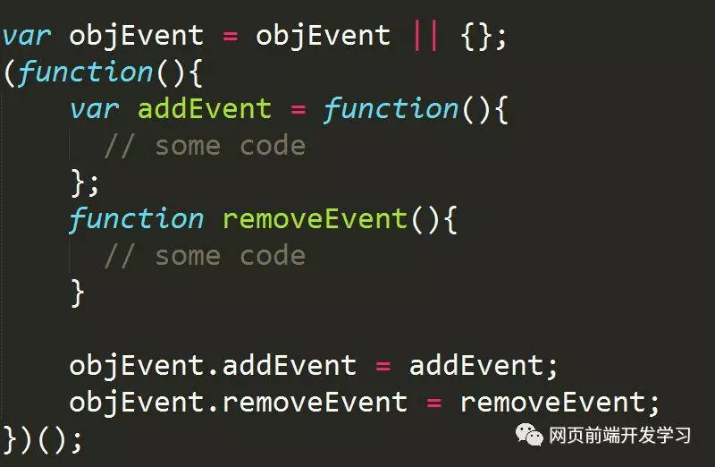

## 什么是闭包（Closure）

简单讲，闭包就是指有权访问另一个函数作用域中的变量的函数。

MDN 上面这么说：闭包是一种特殊的对象。

它由两部分构成：函数，以及创建该函数的环境。
环境由闭包创建时在作用域中的任何局部变量组成。

这种官方的概念是比较难理解的，在面试的时候说出来也不是很专业，因为没办法有个具体的逻辑。

我个人认为，理解闭包的关键在于：外部函数调用之后其变量对象本应该被销毁，但闭包的存在使我们仍然可以访问外部函数的变量对象，这就是闭包的重要概念。

```JavaScript
// 一个闭包的例子
function outer() {
    var a = 1;// 定义一个内部变量
    return function() {
        return a;// 返回a变量值
    };
}

var b = outer();
console.log(b());
```
---
## 产生一个闭包

创建闭包最常见方式，就是在一个函数内部创建另一个函数。下面例子中的 closure 就是一个闭包：

```javascript
function func() {
    var a = 1, b = 2;
    function closure() {//闭包
        return a + b;
    }
    return closure;//返回闭包函数
}
```
闭包的作用域链包含着它自己的作用域，以及包含它的函数的作用域和全局作用域。

---
## 闭包的注意事项
通常，函数的作用域及其所有变量都会在函数执行结束后被销毁。但是，在创建了一个闭包以后，这个函数的作用域就会一直保存到闭包不存在为止。

```javascript
function makeAdder(x) {
    return function(y) {//闭包
        return x + y;
    };
}

var add5 = makeAdder(5);
var add10 = makeAdder(10);
console.log(add5(2));// 7
console.log(add10(2));// 12

// 释放对闭包的引用
add5 = null;
add10 = null;
```

从上述代码可以看到add5 和 add10 都是闭包。它们共享相同的函数定义，但是保存了不同的环境。在 add5 的环境中，x 为 5。而在 add10 中，x 则为 10。最后通过 null 释放了 add5 和 add10 对闭包的引用。

在javascript中，如果一个对象不再被引用，那么这个对象就会被垃圾回收机制回收；

如果两个对象互相引用，而不再被第3者所引用，那么这两个互相引用的对象也会被回收。

---
## 闭包只能取得包含函数中的任何变量的最后一个值

```javascript
function arrFunc() {
    var arr = [];
    for (var i = 0; i < 10; i++) {
        arr[i] = function() {
            return i;
        };
    }
    return arr;
}
```

大家看一下上面这个代码，arr数组中包含了10个匿名函数，每个匿名函数都能访问外部函数的变量i，那么i是多少呢？

当arrFunc执行完毕后，其作用域被销毁，但它的变量对象仍保存在内存中，得以被匿名访问，这时i的值为10

要想保存在循环过程中每一个i的值，需要在匿名函数外部再套用一个匿名函数，在这个匿名函数中定义另一个变量并且立即执行来保存i的值。

```javascript
function arrFunc() {
    var arr = [];
    for (var i = 0; i < 10; i++) {
        arr[i] = function(num) {
            return function() {
                return num;
            };
        }(i);
    }
    return arr;
}
console.log(arrFunc()[1]());
```

这时最内部的匿名函数访问的是num的值，所以数组中10个匿名函数的返回值就是1-10。

## 闭包中的this对象
```javascript
var name = 'window';
var obj = {
    name: 'object',
    getName: function() {
        return function() {
            return this.name;
        };
    }
};
console.log(obj.getName()());
```

在上面这段代码中，obj.getName()()实际上是在全局作用域中调用了匿名函数，this指向了window。

这里要理解函数名与函数功能是分割开的，不要认为函数在哪里，其内部的this就指向哪里。

window才是匿名函数功能执行的环境。

如果想使this指向外部函数的执行环境，可以这样改写：

```javascript
var name = 'window';
var obj = {
    name: 'object',
    getName: function() {
        var that = this;
        return function() {
            return that.name;
        };
    }
};
console.log(obj.getName()());
```

在闭包中，arguments与this也有相同的问题。下面的情况也要注意：

```javascript
var name = 'window';
var obj = {
    name: 'object',
    getName: function() {
        return this.name;
    }
};
obj.getName();// object
(obj.getName = obj.getName)();// window
```

obj.getName();这时getName()是在对象obj的环境中执行的，所以this指向obj。

(obj.getName = obj.getName)赋值语句返回的是等号右边的值，在全局作用域中返回，所以(obj.getName = obj.getName)();的this指向全局。要把函数名和函数功能分割开来

---
## 闭包的应用

应用闭包的主要场合是：设计私有的方法和变量。

任何在函数中定义的变量，都可以认为是私有变量，因为不能在函数外部访问这些变量。私有变量包括函数的参数、局部变量和函数内定义的其他函数。

把有权访问私有变量的公有方法称为特权方法（privileged method）。

```javascript
function Animal() {
    // 私有变量
    var series = "哺乳动物";
    function run() {
        console.log("run!!!");
    }

    // 特权方法
    this.getSeries = function() {
        return series;
    };
}
```

在这里，我们需要理解两个概念：

模块模式（The Module Pattern）：为单例创建私有变量和方法。

单例（singleton）：指的是只有一个实例的对象。JavaScript 一般以对象字面量的方式来创建一个单例对象



上面是普通模式创建的单例，下面使用模块模式创建单例：


匿名函数最大的用途是创建闭包，并且还可以构建命名空间，以减少全局变量的使用。从而使用闭包模块化代码，减少全局变量的污染。



在这段代码中函数 addEvent 和 removeEvent 都是局部变量，但我们可以通过全局变量 objEvent 使用它，这就大大减少了全局变量的使用，增强了网页的安全性。

---
## 运用闭包的关键

闭包引用外部函数变量对象中的值；

在外部函数的外部调用闭包。


## 闭包的缺陷

闭包的缺点就是常驻内存会增大内存使用量，并且使用不当很容易造成内存泄露。

如果不是因为某些特殊任务而需要闭包，在没有必要的情况下，在其它函数中创建函数是不明智的，因为闭包对脚本性能具有负面影响，包括处理速度和内存消耗

