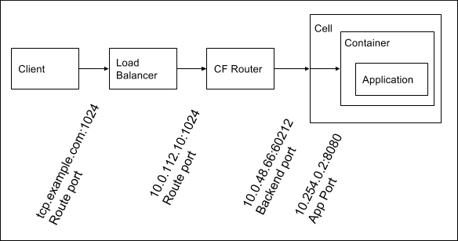
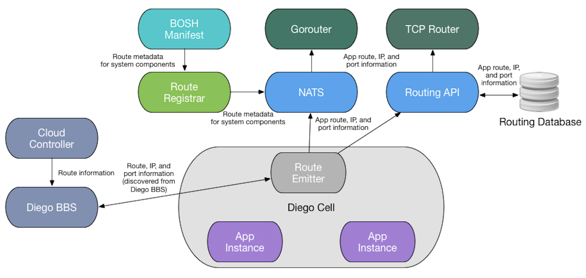
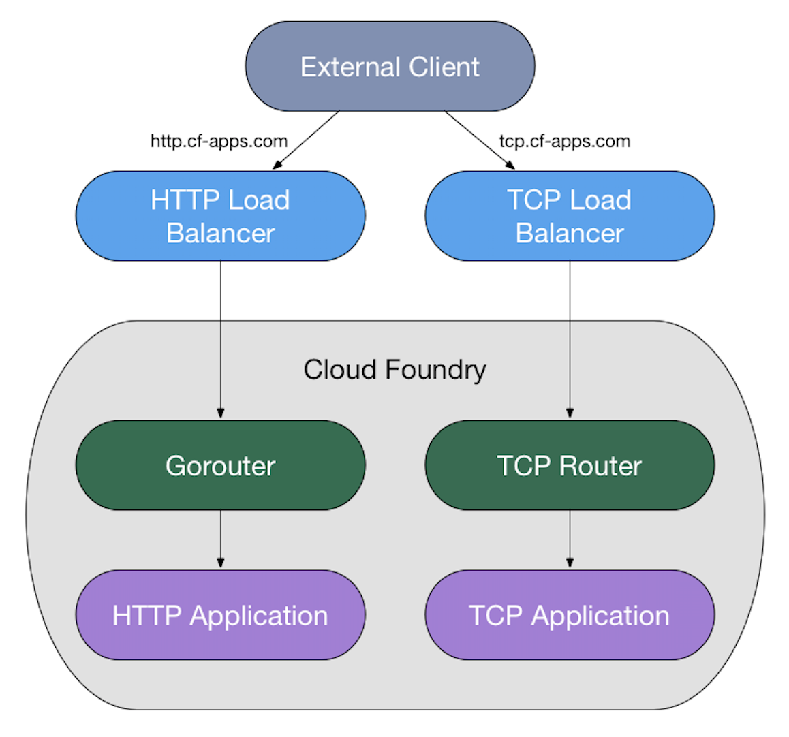
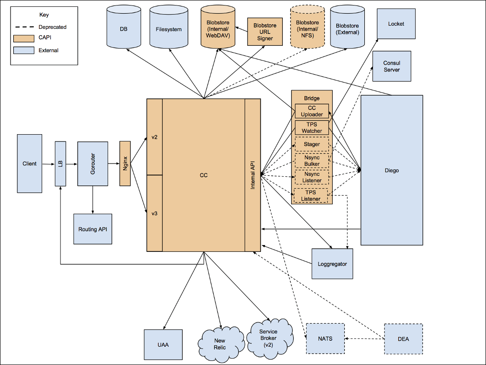

## Routes
The Cloud Foundry Gorouter routes requests to apps by associating an app with an address, known as a route. We call this association a mapping. Use the cf CLI cf map-route command to associate an app and route.

The routing tier compares each request with a list of all the routes mapped to apps and attempts to find the best match. For example, the Gorouter would make the following matches for the two routes myapp.shared-domain.example.com and myapp.shared-domain.example.com/products:

|||
-|-
Request	| Matched Route
http://myapp.shared-domain.example.com|	myapp.shared-domain.example.com
http://myapp.shared-domain.example.com/contact|	myapp.shared-domain.example.com
http://myapp.shared-domain.example.com/products|myapp.shared-domain.example.com/products
http://myapp.shared-domain.example.com/products/123|	myapp.shared-domain.example.com/products
http://products.shared-domain.example.com|	No match; 404

The Gorouter does not use a route to match requests until the route is mapped to an app. In the above example, products.shared-domain.example.com may have been created as a route in Cloud Foundry, but until it is mapped to an app, requests for the route receive a 404.

The routing tier knows the location of instances for apps mapped to routes. Once the routing tier determines a route as the best match for a request, it makes a load-balancing calculation using a `round-robin` algorithm, and forwards the request to an instance of the mapped app.

Developers can map many apps to a single route, resulting in load-balanced requests for the route across all instances of all mapped apps. This approach enables the blue/green zero-downtime deployment strategy. Developers can also map an individual app to multiple routes, enabling access to the app from many URLs. The number of routes that can be mapped to each app is approximately 1000 (128 KB).

Routes belong to a space, and developers can only map apps to a route in the same space.

**Router Balancing Algorithm**

The Gorouter can be configured to use different load balancing algorithms for routing incoming requests to app instances. The Gorouter maintains a dynamically updated list of app instances for each route. Depending on which algorithm is selected, it forwards to one of the app instances.

To configure the behavior, you can change the value of `router.balancing_algorithm` manifest property. The available options are:

- `round-robin` for round-robin algorithm,
- `least-connection` for least connection algorithm,
By default, the Gorouter uses the round-robin algorithm.

- Round-Robin Load Balancing

    Incoming requests for a given route are forwarded to all app instances one after another, looping back to the first one after they have each received a request. This algorithm is suitable for most use cases and evenly distributes the load between app instances.

- Least-Connection Load Balancing

    Each request for a given route is forwarded to the app instance with the least number of open connections. This algorithm can be more suitable for some cases. For example, if app instances have long-lived connections and are scaled up, then new instances receive fewer connections, causing a disproportionate load. In this case, choosing a least-connection algorithm sends new connections to new instances to equalize the load.

---
## Routing Requests to a Specific App Instance

> Note: Usage of X-CF-APP-INSTANCE is supported only for Diego.

Users can route HTTP requests to a specific app instance using the header X-CF-APP-INSTANCE. The format of the header should be X-CF-APP-INSTANCE: APP_GUID:APP_INDEX.

APP_GUID is an internal identifier for your app. Use the cf APP-NAME --guid command to discover the APP_GUID for your app.

```
$ cf app myapp --guid
```

APP_INDEX, for example 0,1, 2, or 3, is an identifier for a particular app instance. Use the CLI command cf app APP-NAME to get statistics on each instance of a particular app.

```
$ cf app myapp
```

The following example shows a request made to instance 9 of an app with GUID 5cdc7595-2e9b-4f62-8d5a-a86b92f2df0e and mapped to route myapp.private-domain.example.com.


```
$ curl myapp.private-domain.example.com -H "X-Cf-App-Instance: 5cdc7595-2e9b-4f62-8d5a-a86b92f2df0e:9"
```

If the cf CLI cannot find the instance the format is incorrect, a 404 status code is returned.

## Using Weighted Routing (Beta)

Weighted routing allows you to map multiple apps to the same route and control the amount of traffic sent to each of them. Some use cases include blue-green deployments, A/B testing, canary releases, or rolling out features over time to incremental user-bases.

## How Weights are Calculated

Cloud Foundry uses numeric weight values to calculate the percentage of requests that each app receives. For a route with multiple apps mapped, the percentage of requests for a given app is calculated as follows:

weight of app / sum of the weights of all apps mapped to route

Consider an example in which two apps are mapped to the same route: app-a and app-b. The percentage of requests for app-b is calculated as follows:

weight of app-b / ( weight of app-a + weight of app-b )

The following table uses example values to show how the percentage of requests is calculated for the two apps:

|||||
-|-|-|-
App|	Weight|	Formula|	Percentage of Requests
app-a|	1|	1 / ( 1 + 3 )|	25%
app-b|	3|	3 / ( 1 + 3 )|	75%

In this example, you can also unmap the route from one of the apps and observe 100% of the requests going to just one app, which simulates a migration.

### Considerations for Working with Routing Weights

Consider the following when working with routing weights:

- The default weight is 1. This means that if multiple apps are mapped to the same route and their weights are not updated, traffic is equally distributed between them.
- The percentage of requests described above is not applied exactly, but over time the requests reflect the percentage.
- You cannot set a weight to 0. You can stop weighting traffic by deleting apps or unmapping apps from the route.
- You cannot exceed 100 routes mappings for a particular route. This could result in some apps not receiving any requests.

### Configure Routing Weights

This procedure describes how to use cf curl to map a route to an app and assign a weight.

1. If you do not already have one, create a route. The route must use the domain created for service mesh:

> cf create-route SPACE-NAME mesh.YOUR-APPS-DOMAIN -n HOSTNAME

Where:

- SPACE-NAME is the space in which you want to create the route.
- YOUR-APPS-DOMAIN is the shared domain for apps configured by your operator.
- HOSTNAME is the hostname to use for creating the route. The format of the route is HOSTNAME.mesh.YOUR-APPS-DOMAIN.

2. Run the following command and record the GUID of your route:

    > cf curl /v2/routes?q=host:HOSTNAME

    Where HOSTNAME is the hostname you specified when creating the route.

    The GUID of the route is located after "metadata": {"guid":. See the following example in which the GUID is highlighted in blue:

    ```
    $ cf curl /v2/routes?q=host:my-hostname
    {
    "total_results": 1,
    "total_pages": 1,
    "prev_url": null,
    "next_url": null,
    "resources": [
        {
        "metadata": {
            "guid": "311d34d1-c045-4853-845f-05132377ad7d",
            "url": "/v2/routes/311d34d1-c045-4853-845f-05132377ad7d",
            "created_at": "2016-06-08T16:41:44Z",
            "updated_at": "2016-06-08T16:41:26Z"
        },
        . . . 
    ```

3. Run the following command and record the GUID of the app that you want to map the route to:
    ```
    cf app APP-NAME --guid
    ```
4. Create a route mapping and assign a weight:
    ```
    cf curl /v3/route_mappings -X POST -d \
    '{
    "relationships": {
        "app": {
        "guid": "APP-GUID"
        },
        "route": {
        "guid": "ROUTE-GUID"
        }
    },
    "weight": WEIGHT
    }'
    ```
    Where:

    - APP-GUID is the app GUID you recorded previously
    - ROUTE-GUID is the route GUID you recorded previously
    - WEIGHT is an integer used to calculate the percentage of requests the app receives. You can enter a value from 1 to 128.

## Flow of a Request to an App

The following table describes the Network Address Translation that occurs in the data path of a client request. The procedure in this document discusses configuring app ports specifically.

||||
-|-|-
Port| Type|	Description	Network Hop
Route port|	The port a client sends a request to|	Client to load balancer, load balancer to Gorouter
Back end port|	The port on the VM where an app container is hosted, which is unique to the container|	Gorouter to Diego Cell
App port|	The port on the container; this must match a port the app is configured to listen on|	Diego Cell to app container

The following diagram provides an example data path and Network Address Translation for TCP routing. For HTTP routing, the route port is always 80 or 443.



-----------------------------------------------------

## Cloud Foundry Routing Architecture

### How Cloud Foundry Maintains Updated Routing Tables

Because each app can have many instances, one app route can go to multiple containers. As Diego moves and scales app instances, the route emitter on each cell sends messages to NATS or the Routing API to register and de-register routes to the cell’s app instances.

The route emitter periodically emits the routes it discovers from Diego BBS to NATS and the Routing API as registration and unregistration messages every twenty seconds. By default, the Gorouter uses TLS to verify app identity and confirm that its routes are up-to-date. With TLS disabled, the Gorouter prunes any routes that the route emitters have not re-registered within the past two minutes.

The following process describes how a router obtains information about routes for an app running on Cloud Foundry:

1. The Cloud Controller component sends app route information to Diego BBS. 

2. Diego BBS coordinates the back end IP address and port where each instance of the app runs. When queried by the route emitter, the BBS sends this information along with Cloud Controller’s app route information to the route emitter on the Diego cell where instances of the app are located.

3. If a route is HTTP, the route emitter on the Diego cells sends app route, IP, and port information to NATS, which then sends it to the Gorouter. If a route is TCP, the route emitter sends that information to the Routing API, which then sends it to the TCP router.

4. The Gorouter and TCP router use the route, IP, and port information from the route emitter to map incoming app requests to back end app instance locations.

    

### External Client Request Flow

When Cloud Foundry’s routing tables are updated, Cloud Foundry can process requests from external clients to an app. The following process describes how an external client makes a request to an app running on Cloud Foundry:

1. The external client sends its request.

2. Your DNS service sends the request to the HTTP or TCP load balancer based on the prefix of the DNS name in the client request, such as http in http.example.com.

3. The load balancer sends the request to the load balancer’s corresponding router.

4. The router sends the request to the app.



### Cloud Controller

The Cloud Controller in Cloud Foundry Application Runtime provides REST API endpoints for clients to access the system. The Cloud Controller maintains a database with tables for orgs, spaces, services, user roles, and more.

Refer to the following diagram for information about internal and external communications of the Cloud Controller.



### Routing Architecture Components

|||
-|-
Component Name|	Summary
BOSH manifest|	Used to configure route registrar with route(s) for system components such as UAA and Loggregator.
Cloud Controller|	Contains route metadata, including whether they are HTTP or TCP.
Diego BBS|	Contains IP and port metadata as well as route metadata from Cloud Controller, which route emitter discovers.
Diego cell|	Manages app instances and tasks and long-running processes related to them. A route emitter runs on each cell.
Gorouter|	Routes HTTP traffic coming into Cloud Foundry to the appropriate component. Receives route updates through NATS. Routes that have not been updated in two minutes are pruned from the Gorouter’s database.
NATS|	Receives routing configuration from route emitter and provides same to Gorouter.
Route registrar|	Sends routing metadata described in BOSH manifest for system components such as UAA and Loggregator to NATS. This is because the Diego cell does not have information about system components, only about user spaces.
Route emitter|	Periodically emits route, IP, and port metadata to NATS or Routing API as registration and unregistration messages. Does not know about app instances on Diego cell, but knows what cell it belongs to and learns about what app instances are running on its cell by asking Diego BBS for information about app instances on the same cell.
Routing API|	Receives routing configuration from route emitter and other internal clients, and provides routing configuration for TCP router.
Routing database|	Saves some routing data from Routing API. If the Gorouter misses a message about an unmapped route from NATS, it will not get it again, so TCP router and Routing API can consult routing database for current state of routes.
TCP router|	Routes TCP traffic coming into Cloud Foundry to the appropriate component. Receives route updates through the routing API.

-----------------------------------------------------