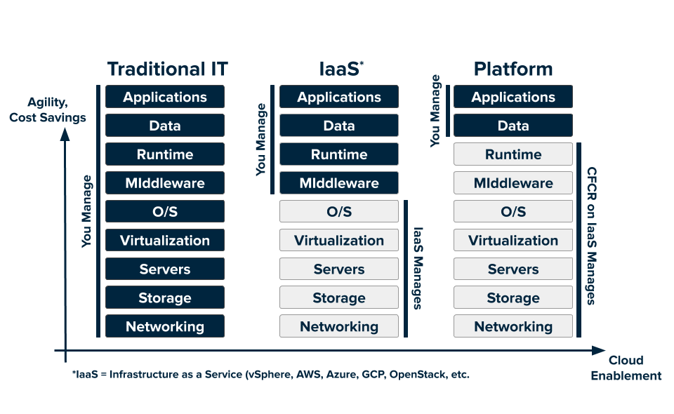

## Cloud Foundry Overview

### Overview
Cloud platforms let anyone deploy network apps or services and make them available to the world in a few minutes. When an app becomes popular, the cloud scales it to handle more traffic, replacing build-out and migration efforts that once took months with a few keystrokes. Cloud platforms enable you to focus exclusively on your apps and data without worrying about underlying infrastructure.

The following diagram shows the layers of a typical technology stack, and compares the traditional IT model to the cloud platform model:

### Load Balancing

This section describes how Cloud Foundry handles load balancing.

Clouds balance their processing loads over multiple machines, optimizing for efficiency and resilience against point failure. A Cloud Foundry installation accomplishes this using the following components: