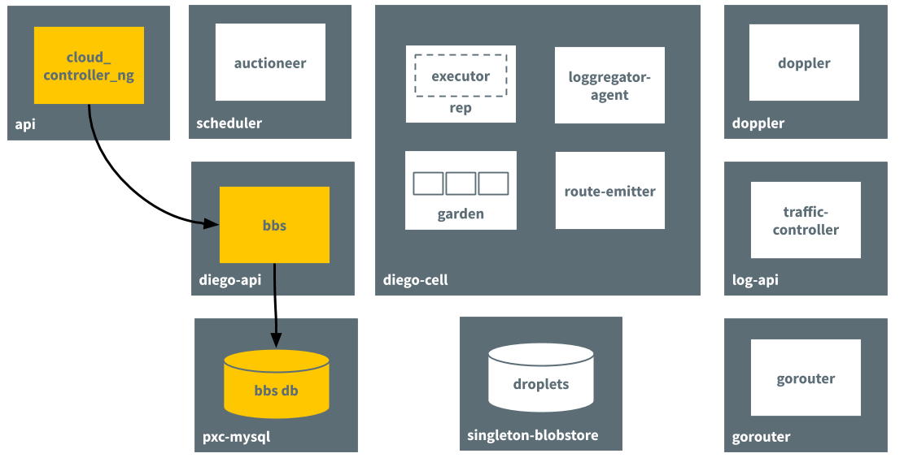
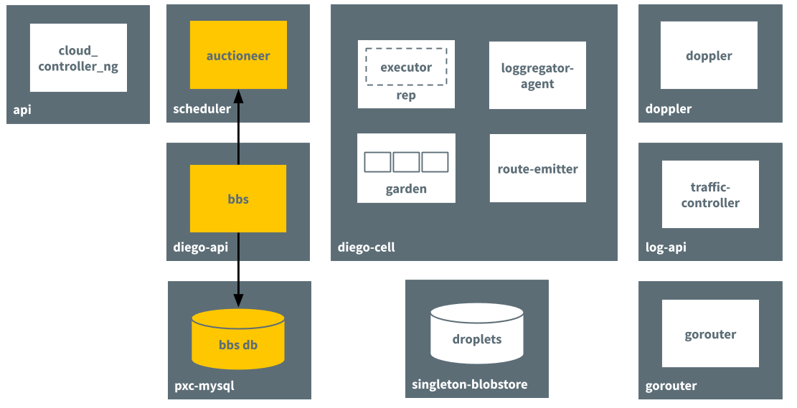
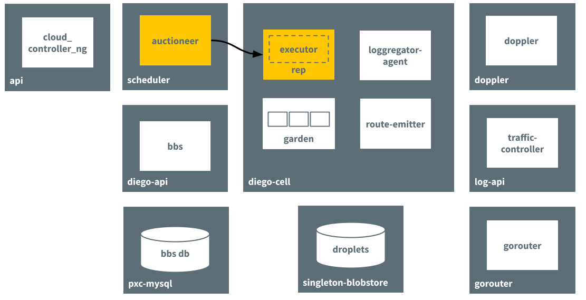
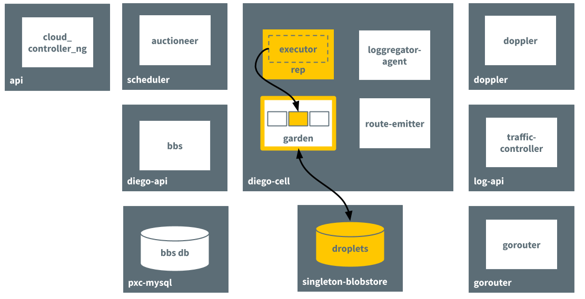
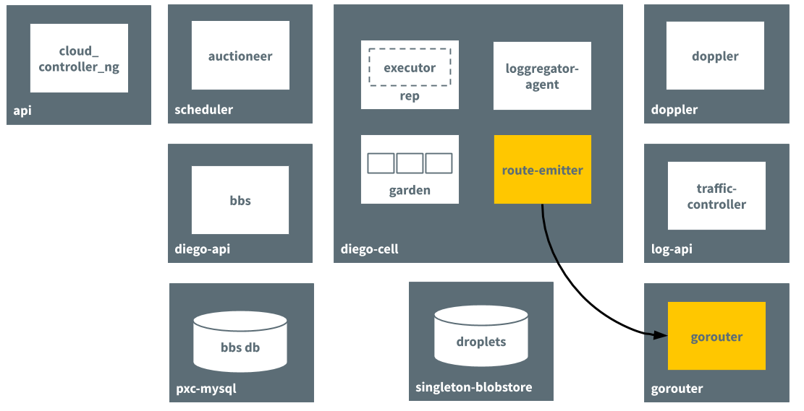
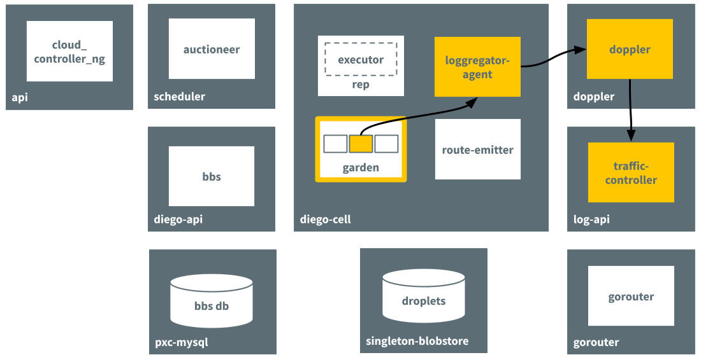

## Diego Components and Architecture

### *Overview*

Cloud Foundry uses the Diego system to manage app containers. Diego components assume app scheduling and management responsibility from the Cloud Controller.

Diego is a self-healing container management system that attempts to keep the correct number of instances running in Diego cells to avoid network failures and crashes. Diego schedules and runs Tasks and Long-Running Processes (LRP)

### *How Diego Runs an App*

The following sections describe how Diego handles a request to run an app. This is only one of the processes that happen in Diego. For example, running an app assumes the app has already been staged. 

### *Receives the Request to Run an App*

The Cloud Controller passes requests to run apps to the Diego BBS, which stores information about the request in its database.

### *Passes Request to the Auctioneer Process*

The BBS contacts the Auctioneer to create an auction based on the desired resources for the app. It references the information stored in its database.

### *Performs Auction*

Through an auction, the Auctioneer finds a Diego cell to run the app on. The Rep job on the Diego cell accepts the auction request.

### *Creates Container and Runs App*

The in-process Executor creates a Garden container in the Diego cell. Garden downloads the droplet that resulted from the staging process and runs the app in the container.

### *Emits Route for App*
The route-emitter process emits a route registration message to Gorouter for the new app running on the the Diego cell.

### *Sends Logs to Loggregator*

The Loggregator agent forwards app logs, errors, and metrics to the Cloud Foundry Loggregator. For more information, see the Application Logging in Cloud Foundry topic.

