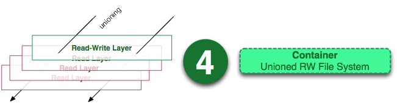

## Docker
我们在理解 docker 之前，首先我们得先区分清楚两个概念，容器和虚拟机。

可能很多读者朋友都用过虚拟机，而对容器这个概念比较的陌生。

我们用的传统虚拟机如 VMware ， VisualBox 之类的需要模拟整台机器包括硬件，每台虚拟机都需要有自己的操作系统，虚拟机一旦被开启，预分配给它的资源将全部被占用。每一台虚拟机包括应用，必要的二进制和库，以及一个完整的用户操作系统。

而容器技术是和我们的宿主机共享硬件资源及操作系统，可以实现资源的动态分配。容器包含应用和其所有的依赖包，但是与其他容器共享内核。容器在宿主机操作系统中，在用户空间以分离的进程运行。

容器技术是实现操作系统虚拟化的一种途径，可以让您在资源受到隔离的进程中运行应用程序及其依赖关系。通过使用容器，我们可以轻松打包应用程序的代码、配置和依赖关系，将其变成容易使用的构建块，从而实现环境一致性、运营效率、开发人员生产力和版本控制等诸多目标。容器可以帮助保证应用程序快速、可靠、一致地部署，其间不受部署环境的影响。容器还赋予我们对资源更多的精细化控制能力，让我们的基础设施效率更高。通过下面这幅图我们可以很直观的反映出这两者的区别所在。


Docker 属于 Linux 容器的一种封装，提供简单易用的容器使用接口。它是目前最流行的 Linux 容器解决方案

而 Linux 容器是 Linux 发展出了另一种虚拟化技术，简单来讲， Linux 容器不是模拟一个完整的操作系统，而是对进程进行隔离，相当于是在正常进程的外面套了一个保护层。对于容器里面的进程来说，它接触到的各种资源都是虚拟的，从而实现与底层系统的隔离。

Docker 将应用程序与该程序的依赖，打包在一个文件里面。运行这个文件，就会生成一个虚拟容器。程序在这个虚拟容器里运行，就好像在真实的物理机上运行一样。有了 Docker ，就不用担心环境问题。

总体来说， Docker 的接口相当简单，用户可以方便地创建和使用容器，把自己的应用放入容器。容器还可以进行版本管理、复制、分享、修改，就像管理普通的代码一样。

---
## Docker的优势
### Docker相比于传统虚拟化方式具有更多的优势：
* docker 启动快速属于秒级别。虚拟机通常需要几分钟去启动
* docker 需要的资源更少， docker 在操作系统级别进行虚拟化， docker 容器和内核交互，几乎没有性能损耗，性能优于通过 Hypervisor 层与内核层的虚拟化
* docker 更轻量， docker 的架构可以共用一个内核与共享应用程序库，所占内存极小。同样的硬件环境， Docker 运行的镜像数远多于虚拟机数量，对系统的利用率非常高
* 与虚拟机相比， docker 隔离性更弱， docker 属于进程之间的隔离，虚拟机可实现系统级别隔离
* 安全性： docker 的安全性也更弱。 Docker 的租户 root 和宿主机 root 等同，一旦容器内的用户从普通用户权限提升为root权限，它就直接具备了宿主机的root权限，进而可进行无限制的操作。虚拟机租户 root 权限和宿主机的 root 虚拟机权限是分离的，并且虚拟机利用如 Intel 的 VT-d 和 VT-x 的 ring-1 硬件隔离技术，这种隔离技术可以防止虚拟机突破和彼此交互，而容器至今还没有任何形式的硬件隔离，这使得容器容易受到攻击
* 可管理性： docker 的集中化管理工具还不算成熟。各种虚拟化技术都有成熟的管理工具，例如 VMware vCenter 提供完备的虚拟机管理能力
* 高可用和可恢复性： docker 对业务的高可用支持是通过快速重新部署实现的。虚拟化具备负载均衡，高可用，容错，迁移和数据保护等经过生产实践检验的成熟保障机制， VMware 可承诺虚拟机 99.999% 高可用，保证业务连续性
* 快速创建、删除：虚拟化创建是分钟级别的， Docker 容器创建是秒级别的， Docker 的快速迭代性，决定了无论是开发、测试、部署都可以节约大量时间
* 交付、部署：虚拟机可以通过镜像实现环境交付的一致性，但镜像分发无法体系化。 Docker 在 Dockerfile 中记录了容器构建过程，可在集群中实现快速分发和快速部署

我们可以从下面这张表格很清楚地看到容器相比于传统虚拟机的特性的优势所在：

|  |  |  |
|--|--|--|
|特性       |容器             |虚拟机
|启动	    |秒级             |分钟级
|硬盘使用   |一般为MB	       |一般为GB
|性能       | 接近原生	       |弱于
|系统支持量	|单机支持上千个容器 |一般是几十个


---

从上图我们可以看到，Docker 中包括三个基本的概念：

* Image(镜像)
* Container(容器)
* Repository(仓库)

镜像是 Docker 运行容器的前提，仓库是存放镜像的场所，可见镜像更是 Docker 的核心。

### Image (镜像)

那么镜像到底是什么呢？

Docker 镜像可以看作是一个特殊的文件系统，除了提供容器运行时所需的程序、库、资源、配置等文件外，还包含了一些为运行时准备的一些配置参数（如匿名卷、环境变量、用户等）。镜像不包含任何动态数据，其内容在构建之后也不会被改变。

镜像（Image）就是一堆只读层（read-only layer）的统一视角，也许这个定义有些难以理解，下面的这张图能够帮助读者理解镜像的定义。


从左边我们看到了多个只读层，它们重叠在一起。除了最下面一层，其它层都会有一个指针指向下一层。这些层是Docker 内部的实现细节，并且能够在主机的文件系统上访问到。统一文件系统 (union file system) 技术能够将不同的层整合成一个文件系统，为这些层提供了一个统一的视角，这样就隐藏了多层的存在，在用户的角度看来，只存在一个文件系统。我们可以在图片的右边看到这个视角的形式


### Container (容器)

容器 (container) 的定义和镜像 (image) 几乎一模一样，也是一堆层的统一视角，唯一区别在于容器的最上面那一层是可读可写的。



由于容器的定义并没有提及是否要运行容器，所以实际上，容器 = 镜像 + 读写层。

### Repository (仓库)

Docker 仓库是集中存放镜像文件的场所。镜像构建完成后，可以很容易的在当前宿主上运行，但是， 如果需要在其它服务器上使用这个镜像，我们就需要一个集中的存储、分发镜像的服务，Docker Registry (仓库注册服务器)就是这样的服务。有时候会把仓库 (Repository) 和仓库注册服务器 (Registry) 混为一谈，并不严格区分。Docker 仓库的概念跟 Git 类似，注册服务器可以理解为 GitHub 这样的托管服务。实际上，一个 Docker Registry 中可以包含多个仓库 (Repository) ，每个仓库可以包含多个标签 (Tag)，每个标签对应着一个镜像。所以说，镜像仓库是 Docker 用来集中存放镜像文件的地方类似于我们之前常用的代码仓库。

通常，一个仓库会包含同一个软件不同版本的镜像，而标签就常用于对应该软件的各个版本 。我们可以通过<仓库名>:<标签>的格式来指定具体是这个软件哪个版本的镜像。如果不给出标签，将以 latest 作为默认标签

仓库又可以分为两种形式：

* public(公有仓库)
* private(私有仓库)

Docker Registry 公有仓库是开放给用户使用、允许用户管理镜像的 Registry 服务。一般这类公开服务允许用户免费上传、下载公开的镜像，并可能提供收费服务供用户管理私有镜像。

除了使用公开服务外，用户还可以在本地搭建私有 Docker Registry 。Docker 官方提供了 Docker Registry镜像，可以直接使用做为私有 Registry 服务。当用户创建了自己的镜像之后就可以使用 push 命令将它上传到公有或者私有仓库，这样下次在另外一台机器上使用这个镜像时候，只需要从仓库上 pull 下来就可以了。

我们主要把 Docker 的一些常见概念如 Image ， Container ， Repository 做了详细的阐述，也从传统虚拟化方式的角度阐述了 docker 的优势，我们从下图可以直观地看到 Docker 的架构：


Docker 使用 C/S 结构，即客户端/服务器体系结构。 Docker 客户端与 Docker 服务器进行交互，Docker服务端负责构建、运行和分发 Docker 镜像。 Docker 客户端和服务端可以运行在一台机器上，也可以通过 RESTful 、 stock 或网络接口与远程 Docker 服务端进行通信。


这张图展示了 Docker 客户端、服务端和 Docker 仓库（即 Docker Hub 和 Docker Cloud ），默认情况下Docker 会在 Docker 中央仓库寻找镜像文件，这种利用仓库管理镜像的设计理念类似于 Git ，当然这个仓库是可以通过修改配置来指定的，甚至我们可以创建我们自己的私有仓库。

---

Docker 提供了一套简单实用的命令来创建和更新镜像，我们可以通过网络直接下载一个已经创建好了的应用镜像，并通过 Docker RUN 命令就可以直接使用。当镜像通过 RUN 命令运行成功后，这个运行的镜像就是一个 Docker 容器啦，容器可以理解为一个轻量级的沙箱， Docker 利用容器来运行和隔离应用，容器是可以被启动、停止、删除的，这并不会影响 Docker 镜像。


Docker 客户端是 Docker 用户与 Docker 交互的主要方式。当您使用 docker 命令行运行命令时， Docker 客户端将这些命令发送给服务器端，服务端将执行这些命令。 docker 命令使用 docker API 。 Docker 客户端可以与多个服务端进行通信。

我们将剖析一下 Docker 容器是如何工作的，学习好Docker容器工作的原理，我们就可以自己去管理我们的容器了。

---
## Docker架构
Docker 的核心组件包括：
1. Docker Client
2. Docker daemon
3. Docker Image
4. Docker Registry
5. Docker Container

### Docker Client

Docker Client ，也称 Docker 客户端。它其实就是 Docker 提供命令行界面 (CLI) 工具，是许多 Docker 用户与 Docker 进行交互的主要方式。客户端可以构建，运行和停止应用程序，还可以远程与Docker_Host进行交互。最常用的 Docker 客户端就是 docker 命令，我们可以通过 docker 命令很方便地在 host 上构建和运行 docker 容器。


### Docker daemon

Docker daemon 是服务器组件，以 Linux 后台服务的方式运行，是 Docker 最核心的后台进程，我们也把它称为守护进程。它负责响应来自 Docker Client 的请求，然后将这些请求翻译成系统调用完成容器管理操作。该进程会在后台启动一个 API Server ，负责接收由 Docker Client 发送的请求，接收到的请求将通过Docker daemon 内部的一个路由分发调度，由具体的函数来执行请求。


我们大致可以将其分为以下三部分：

* Docker Server
* Engine
* Job

Docker Daemon的架构如下所示：


Docker Daemon 可以认为是通过 Docker Server 模块接受 Docker Client 的请求，并在 Engine 中处理请求，然后根据请求类型，创建出指定的 Job 并运行。 Docker Daemon 运行在 Docker host 上，负责创建、运行、监控容器，构建、存储镜像。

运行过程的作用有以下几种可能：

* 向 Docker Registry 获取镜像
* 通过 graphdriver 执行容器镜像的本地化操作
* 通过 networkdriver 执行容器网络环境的配置
* 通过 execdriver 执行容器内部运行的执行工作

由于 Docker Daemon 和 Docker Client 的启动都是通过可执行文件 docker 来完成的，因此两者的启动流程非常相似。 Docker 可执行文件运行时，运行代码通过不同的命令行 flag 参数，区分两者，并最终运行两者各自相应的部分。

启动 Docker Daemon 时，一般可以使用以下命令来完成

```
docker --daemon = true
docker –d
docker –d = true
```
再由 docker 的 main() 函数来解析以上命令的相应 flag 参数，并最终完成 Docker Daemon 的启动。

下图可以很直观地看到 Docker Daemon 的启动流程：


默认配置下， Docker daemon 只能响应来自本地 Host 的客户端请求。如果要允许远程客户端请求，需要在配置文件中打开 TCP 监听。


### Docker Image

Docker 镜像可以看作是一个特殊的文件系统，除了提供容器运行时所需的程序、库、资源、配置等文件外，还包含了一些为运行时准备的一些配置参数（如匿名卷、环境变量、用户等）。镜像不包含任何动态数据，其内容在构建之后也不会被改变。我们可将 Docker 镜像看成只读模板，通过它可以创建 Docker 容器。

镜像有多种生成方法：

1. 从无到有开始创建镜像
2. 下载并使用别人创建好的现成的镜像
3. 在现有镜像上创建新的镜像

我们可以将镜像的内容和创建步骤描述在一个文本文件中，这个文件被称作 Dockerfile ，通过执行 docker build <docker-file> 命令可以构建出 Docker 镜像

### Docker Registry

Docker registry 是存储 docker image 的仓库，它在 docker 生态环境中的位置如下图所示：


运行docker push、docker pull、docker search时，实际上是通过 docker daemon 与 docker registry 通信。

### Docker Container
Docker 容器就是 Docker 镜像的运行实例，是真正运行项目程序、消耗系统资源、提供服务的地方。 Docker Container 提供了系统硬件环境，我们可以使用 Docker Images 这些制作好的系统盘，再加上我们所编写好的项目代码， run 一下就可以提供服务啦。

容器启动过程如下：

* Docker 客户端执行 docker run 命令
* Docker daemon 发现本地没有 hello-world 镜像
* daemon 从 Docker Hub 下载镜像
* 下载完成，镜像 hello-world 被保存到本地
* Docker daemon 启动容器

具体过程可以看如下这幅演示图：


---

## Docker常用命令


---
## Dockerfile是什么

前面我们已经提到了 Docker 的一些基本概念。以 CTF 选手的角度来看，我们可以去使用 Dockerfile 定义镜像，依赖镜像来运行容器，可以去模拟出一个真实的漏洞场景。因此毫无疑问的说， Dockerfile 是镜像和容器的关键，并且 Dockerfile 还可以很轻易的去定义镜像内容，说了这么多，那么 Dockerfile 到底是个什么东西呢？

Dockerfile 是自动构建 docker 镜像的配置文件， 用户可以使用 Dockerfile 快速创建自定义的镜像。Dockerfile 中的命令非常类似于 linux 下的 shell 命令。

我们可以通过下面这幅图来直观地感受下 Docker 镜像、容器和 Dockerfile 三者之间的关系


我们从上图中可以看到， Dockerfile 可以自定义镜像，通过 Docker 命令去运行镜像，从而达到启动容器的目的。

Dockerfile 是由一行行命令语句组成，并且支持已 # 开头的注释行。

一般来说，我们可以将 Dockerfile 分为四个部分：

* 基础镜像(父镜像)信息指令 FROM
* 维护者信息指令 MAINTAINER
* 镜像操作指令 RUN 、 EVN 、 ADD 和 WORKDIR 等
* 容器启动指令 CMD 、 ENTRYPOINT 和 USER 等

---

# Docker入门实战

## 产生背景

* 开发和运维之间因为环境不同而导致的矛盾
* 集群环境下每台机器部署相同的应用
* DevOps（Development and Operations）

## 简介

Docker是一个开源的应用容器引擎，让开发者可以打包他们的应用以及依赖包到一个可移植的容器中，然后发布到任何流行的Linux机器上，也可以实现虚拟化，容器是完全使用沙箱机制，相互之间不会有任何接口。

Docker是世界领先的软件容器平台。开发人员利用Docker可以消除协作编码时“在我的机器上可正常工作”的问题。运维人员利用Docker可以在隔离容器中并行运行和管理应用，获得更好的计算密度。企业利用Docker可以构建敏捷的软件交付管道，以更快的速度、更高的安全性和可靠的信誉为Linux和Windows Server应用发布新功能。

## Docker优点

简化程序：
Docker让开发者可以打包他们的应用以及依赖包到一个可移植的容器中，然后发布到任何流行的Linux机器上，便可以实现虚拟化。Docker改变了虚拟化的方式，使开发者可以直接将自己的成果放入Docker中进行管理。方便快捷已经是Docker的最大优势，过去需要用数天乃至数周的任务，在Docker容器的处理下，只需要数秒就能完成。

避免选择恐惧症：
如果你有选择恐惧症，还是资深患者。Docker帮你打包你的纠结！比如Docker镜像；Docker镜像中包含了运行环境和配置，所以Docker可以简化部署多种应用实例工作。比如Web应用、后台应用、数据库应用、大数据应用比如Hadoop集群、消息队列等等都可以打包成一个镜像部署。

节省开支：
一方面，云计算时代到来，使开发者不必为了追求效果而配置高额的硬件，Docker改变了高性能必然高价格的思维定势。Docker与云的结合，让云空间得到更充分的利用。不仅解决了硬件管理的问题，也改变了虚拟化的方式。

## Docker架构

Docker使用C/S架构，Client通过接口与Server进程通信实现容器的构建，运行和发布，如图：


## Host（Docker 宿主机）

    安装了Docker程序，并运行了Docker daemon的主机。

    Docker daemon（Docker 守护进程）：
    运行在宿主机上，Docker守护进程，用户通过Docker client(Docker命令)与Docker daemon交互。

    Images（镜像）：
    将软件环境打包好的模板，用来创建容器的，一个镜像可以创建多个容器。

    Containers（容器）：
    Docker的运行组件，启动一个镜像就是一个容器，容器与容器之间相互隔离，并且互不影响。

## Docker Client（Docker 客户端）

    Docker命令行工具，用户是用Docker Clients与Docker daemon进行通信并返回结果给用户。也可以使用其他工具通过Docker Api与Docker daemon通信。

## Registry(仓库服务注册器)

    经常会和仓库(Repository)混为一谈，实际上Registry上可以有多个仓库，每个仓库可以看成是一个用户， 一个用户的仓库放了多个镜像。仓库分为了公开仓库(Public Repository)和私有仓库(Private Repository)，最大的公开仓库是官方的Docker Hub，国内也有如阿里云、时速云等，可以给国内用户提供稳定快速的服务。用户也可以在本地网络内创建一个私有仓库。当用户创建了自己的镜像之后就可以使用push命令将它上传到公有或者私有仓库，这样下次在另外一台机器上使用这个镜像时候，只需要从仓库上pull下来就可以了。