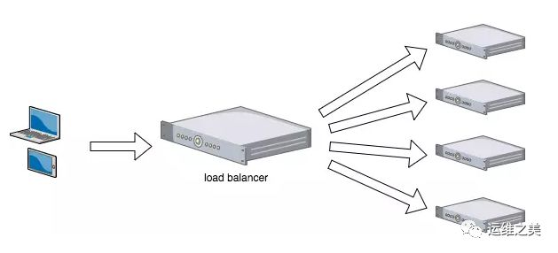
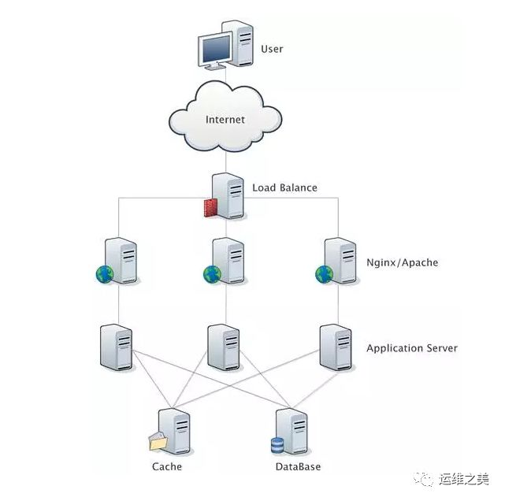
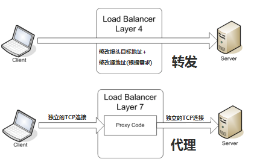
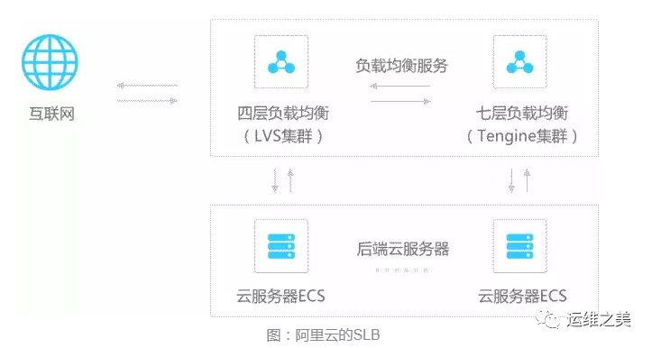
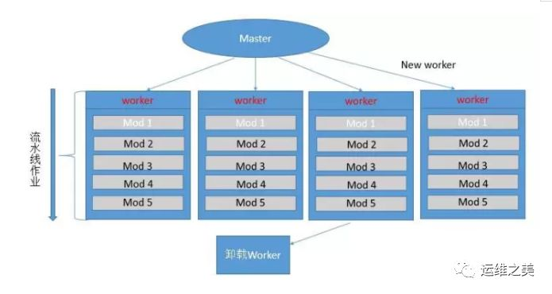
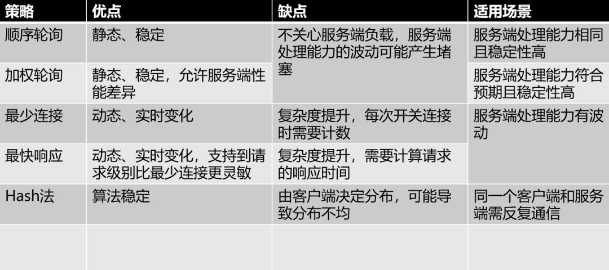

## 几种常用负载均衡架构

### 什么是负载均衡（Load balancing）

在网站创立初期，我们一般都使用单台机器对台提供集中式服务，但随着业务量越来越大，无论性能还是稳定性上都有了更大的挑战。这时候我们就会想到通过扩容的方式来提供更好的服务。我们一般会把多台机器组成一个集群对外提供服务。

然而，我们的网站对外提供的访问入口都是一个的，比如www.taobao.com。那么当用户在浏览器输入 www.taobao.com 的时候如何将用户的请求分发到集群中不同的机器上呢，这就是负载均衡在做的事情。

当前大多数的互联网系统都使用了服务器集群技术，集群即将相同服务部署在多台服务器上构成一个集群整体对外提供服务，这些集群可以是 Web 应用服务器集群，也可以是数据库服务器集群，还可以是分布式缓存服务器集群等。

在实际应用中，在 Web 服务器集群之前总会有一台负载均衡服务器，负载均衡设备的任务就是作为 Web 服务器流量的入口，挑选最合适的一台 Web 服务器，将客户端的请求转发给它处理，实现客户端到真实服务端的透明转发。

最近几年很火的「云计算」以及分布式架构，本质上也是将后端服务器作为计算资源、存储资源，由某台管理服务器封装成一个服务对外提供，客户端不需要关心真正提供服务的是哪台机器，在它看来，就好像它面对的是一台拥有近乎无限能力的服务器，而本质上，真正提供服务的是后端的集群。

软件负载解决的两个核心问题是：选谁、转发，其中最著名的是 LVS（Linux Virtual Server）。

一个典型的互联网应用的拓扑结构是这样的：

---
### 负载均衡分类

现在我们知道，负载均衡就是一种计算机网络技术，用来在多个计算机（计算机集群）、网络连接、CPU、磁碟驱动器或其它资源中分配负载，以达到最佳化资源使用、最大化吞吐率、最小化响应时间、同时避免过载的目的。那么，这种计算机技术的实现方式有多种。

大致可以分为以下几种，其中最常用的是四层和七层负载均衡：

**二层负载均衡 (链路层的负载均衡)**

负载均衡服务器对外依然提供一个 VIP（虚IP），集群中不同的机器采用相同 IP地址，但机器的 MAC 地址不一样。当负载均衡服务器接受到请求之后，通过改写报文的目标 MAC 地址的方式将请求转发到目标机器实现负载均衡。

**三层负载均衡 (IP层负载均衡)**

和二层负载均衡类似，负载均衡服务器对外依然提供一个 VIP（虚IP），但集群中不同的机器采用不同的 IP 地址。当负载均衡服务器接受到请求之后，根据不同的负载均衡算法，通过 IP 将请求转发至不同的真实服务器。

**四层负载均衡**

四层负载均衡工作在 OSI 模型的传输层，由于在传输层，只有 TCP/UDP 协议，这两种协议中除了包含源 IP、目标 IP 以外，还包含源端口号及目的端口号。四层负载均衡服务器在接受到客户端请求后，以后通过修改数据包的地址信息（ IP+端口号 ）将流量转发到应用服务器。

**七层负载均衡**

七层负载均衡工作在 OSI 模型的应用层，应用层协议较多，常用 HTTP、Radius、DNS 等。七层负载就可以基于这些协议来负载。这些应用层协议中会包含很多有意义的内容。比如同一个 Web 服务器的负载均衡，除了根据 IP 加端口进行负载外，还可根据七层的 URL、浏览器类别、语言来决定是否要进行负载均衡。

对于一般的应用来说，有了 Nginx 就够了。Nginx 可以用于七层负载均衡。但是对于一些大的网站，一般会采用 DNS+四层负载+七层负载的方式进行多层次负载均衡。

---
### 常用负载均衡工具

硬件负载均衡性能优越，功能全面，但价格昂贵，一般适合初期或者土豪级公司长期使用。因此软件负载均衡在互联网领域大量使用。常用的软件负载均衡软件有 Nginx、LVS、HaProxy 等。

Nginx/LVS/HAProxy 是目前使用最广泛的三种负载均衡软件。

1. LVS

    LVS（Linux Virtual Server），也就是 Linux 虚拟服务器，是一个由章文嵩博士发起的自由软件项目。使用 LVS 技术要达到的目标是：通过 LVS 提供的负载均衡技术和 Linux 操作系统实现一个高性能、高可用的服务器群集，它具有良好可靠性、可扩展性和可操作性。从而以低廉的成本实现最优的服务性能。

    LVS 主要用来做四层负载均衡。

    **LVS 架构**

    LVS 架设的服务器集群系统由三个部分组成：最前端的负载均衡层（Loader Balancer），中间的服务器群组层，用 Server Array 表示，最底层的数据共享存储层，用 Shared Storage 表示。在用户看来所有的应用都是透明的，用户只是在使用一个虚拟服务器提供的高性能服务。

    **LVS 的各个层次的详细介绍**：

    `Load Balancer 层`：位于整个集群系统的最前端，有一台或者多台负载调度器（Director Server）组成，LVS 模块就安装在 Director Server上，而 Director 的主要作用类似于一个路由器，它含有完成 LVS 功能所设定的路由表，通过这些路由表把用户的请求分发给 Server Array 层的应用服务器（Real Server）上。同时，在 Director Server 上还要安装对 Real Server 服务的监控模块 Ldirectord，此模块用于监测各个 Real Server 服务的健康状况。在 Real Server 不可用时把它从 LVS 路由表中剔除，恢复时重新加入。

    `Server Array 层`：由一组实际运行应用服务的机器组成，Real Server 可以是 Web 服务器、Mail 服务器、FTP 服务器、DNS 服务器、视频服务器中的一个或者多个，每个 Real Server 之间通过高速的 LAN 或分布在各地的 WAN 相连接。在实际的应用中，Director Server 也可以同时兼任 Real Server 的角色。

    `Shared Storage 层`：是为所有 Real Server 提供共享存储空间和内容一致性的存储区域，在物理上一般由磁盘阵列设备组成，为了提供内容的一致性，一般可以通过 NFS 网络文件系统共享数 据，但 NFS 在繁忙的业务系统中，性能并不是很好，此时可以采用集群文件系统，例如 Redhat 的 GFS 文件系统、Oracle 提供的 OCFS2 文件系统等。

    从整个 LVS 结构可以看出，Director Server 是整个 LVS 的核心，目前用于 Director Server 的操作系统只能是 Linux 和 FreeBSD，Linux 2.6 内核不用任何设置就可以支持 LVS 功能，而 FreeBSD 作为 Director Server 的应用还不是很多，性能也不是很好。对于 Real Server，几乎可以是所有的系统平台，Linux、windows、Solaris、AIX、BSD 系列都能很好地支持。

2. Nginx

    Nginx（发音同 engine x）是一个网页服务器，它能反向代理 HTTP、HTTPS,、SMTP、POP3、IMAP的协议链接，以及一个负载均衡器和一个HTTP缓存。

    Nginx 主要用来做七层负载均衡。

    并发性能：官方支持每秒 5 万并发，实际国内一般到每秒 2 万并发，有优化到每秒 10 万并发的。具体性能看应用场景。

    *特点*：
    * 模块化设计：良好的扩展性，可以通过模块方式进行功能扩展。

    * 高可靠性：主控进程和 worker 是同步实现的，一个 worker 出现问题，会立刻启动另一个 worker。

    * 内存消耗低：一万个长连接（keep-alive）,仅消耗 2.5 MB 内存。

    * 支持热部署：不用停止服务器，实现更新配置文件，更换日志文件、更新服务器程序版本。

    * 并发能力强：官方数据每秒支持 5 万并发；

    * 功能丰富：优秀的反向代理功能和灵活的负载均衡策略

    **Nginx 的基本工作模式**

    

    一个 master 进程，生成一个或者多个 worker 进程。但这里 master 是使用 root 身份启动的，因为 Nginx 要工作在 80 端口。而只有管理员才有权限启动小于低于 1023 的端口。master 主要是负责的作用只是启动 worker，加载配置文件，负责系统的平滑升级。其它的工作是交给 worker。那当 worker 被启动之后，也只是负责一些 web 最简单的工作，而其它的工作都是由 worker 中调用的模块来实现的。

    模块之间是以流水线的方式实现功能的。流水线，指的是一个用户请求，由多个模块组合各自的功能依次实现完成的。比如：第一个模块只负责分析请求首部，第二个模块只负责查找数据，第三个模块只负责压缩数据，依次完成各自工作。来实现整个工作的完成。

    它们是如何实现热部署的呢？是这样的，我们前面说 master 不负责具体的工作，而是调用 worker 工作，它只是负责读取配置文件，因此当一个模块修改或者配置文件发生变化，是由 master 进行读取，因此此时不会影响到 worker 工作。在 master 进行读取配置文件之后，不会立即把修改的配置文件告知 worker 。而是让被修改的 worker 继续使用老的配置文件工作，当 worker 工作完毕之后，直接当掉这个子进程，更换新的子进程，使用新的规则。

3. HAProxy

    HAProxy 也是使用较多的一款负载均衡软件。HAProxy 提供高可用性、负载均衡以及基于 TCP 和 HTTP 应用的代理，支持虚拟主机，是免费、快速并且可靠的一种解决方案。特别适用于那些负载特大的 Web站点。运行模式使得它可以很简单安全的整合到当前的架构中，同时可以保护你的web服务器不被暴露到网络上。

    HAProxy 是一个使用 C 语言编写的自由及开放源代码软件，其提供高可用性、负载均衡，以及基于 TCP 和 HTTP 的应用程序代理。

    Haproxy 主要用来做七层负载均衡。

---

### 常见负载均衡算法

上面介绍负载均衡技术的时候提到过，负载均衡服务器在决定将请求转发到具体哪台真实服务器时，是通过负载均衡算法来实现的。负载均衡算法可以分为两类：静态负载均衡算法和动态负载均衡算法。

* 静态负载均衡算法包括：轮询、比率、优先权。

* 动态负载均衡算法包括：最少连接数、最快响应速度、观察方法、预测法、动态性能分配、动态服务器补充、服务质量、服务类型、规则模式。

`轮询（Round Robin）`：顺序循环将请求一次顺序循环地连接每个服务器。当其中某个服务器发生第二到第 7 层的故障，BIG-IP 就把其从顺序循环队列中拿出，不参加下一次的轮询，直到其恢复正常。

以轮询的方式依次请求调度不同的服务器；实现时，一般为服务器带上权重；这样有两个好处：针对服务器的性能差异可分配不同的负载；当需要将某个结点剔除时，只需要将其权重设置为0即可；

* 优点：实现简单、高效；易水平扩展

* 缺点：请求到目的结点的不确定，造成其无法适用于有写的场景（缓存，数据库写）

* 应用场景：数据库或应用服务层中只有读的场景

`随机方式`：请求随机分布到各个结点；在数据足够大的场景能达到一个均衡分布；

* 优点：实现简单、易水平扩展

* 缺点：同 Round Robin，无法用于有写的场景

* 应用场景：数据库负载均衡，也是只有读的场景

`哈希方式`：根据 key 来计算需要落在的结点上，可以保证一个同一个键一定落在相同的服务器上；

* 优点：相同 key 一定落在同一个结点上，这样就可用于有写有读的缓存场景

* 缺点：在某个结点故障后，会导致哈希键重新分布，造成命中率大幅度下降

* 解决：一致性哈希 or 使用 keepalived 保证任何一个结点的高可用性，故障后会有其它结点顶上来

* 应用场景：缓存，有读有写

`根据键的范围来负载`：根据键的范围来负载，前 1 亿个键都存放到第一个服务器，1~2 亿在第二个结点。

优点：水平扩展容易，存储不够用时，加服务器存放后续新增数据

缺点：负载不均；数据库的分布不均衡；

（数据有冷热区分，一般最近注册的用户更加活跃，这样造成后续的服务器非常繁忙，而前期的结点空闲很多）

适用场景：数据库分片负载均衡

`纯动态结点负载均衡`：根据 CPU、IO、网络的处理能力来决策接下来的请求如何调度。

优点：充分利用服务器的资源，保证个结点上负载处理均衡

缺点：实现起来复杂，真实使用较少

`不用主动负载均衡`：使用消息队列转为异步模型，将负载均衡的问题消灭；负载均衡是一种推模型，一直向你发数据，那么将所有的用户请求发到消息队列中，所有的下游结点谁空闲，谁上来取数据处理；转为拉模型之后，消除了对下行结点负载的问题。

优点：通过消息队列的缓冲，保护后端系统，请求剧增时不会冲垮后端服务器；水平扩展容易，加入新结点后，直接取 queue 即可；
缺点：不具有实时性；

应用场景：不需要实时返回的场景；比如，12036 下订单后，立刻返回提示信息：您的订单进去排队了...等处理完毕后，再异步通知；

`比率（Ratio）`：给每个服务器分配一个加权值为比例，根椐这个比例，把用户的请求分配到每个服务器。当其中某个服务器发生第 2 到第 7 层的故障，BIG-IP 就把其从服务器队列中拿出，不参加下一次的用户请求的分配，直到其恢复正常。

`优先权（Priority）`：给所有服务器分组，给每个组定义优先权，BIG-IP 用户的请求，分配给优先级最高的服务器组（在同一组内，采用轮询或比率算法，分配用户的请求）；当最高优先级中所有服务器出现故障，BIG-IP 才将请求送给次优先级的服务器组。这种方式，实际为用户提供一种热备份的方式。

`最少的连接方式（Least Connection）`：传递新的连接给那些进行最少连接处理的服务器。当其中某个服务器发生第 2 到第 7 层的故障，BIG-IP 就把其从服务器队列中拿出，不参加下一次的用户请求的分配，直到其恢复正常。

`最快模式（Fastest）`：传递连接给那些响应最快的服务器。当其中某个服务器发生第二到第7 层的故障，BIG-IP 就把其从服务器队列中拿出，不参加下一次的用户请求的分配，直到其恢复正常。

`观察模式（Observe）`：连接数目和响应时间以这两项的最佳平衡为依据为新的请求选择服务器。当其中某个服务器发生第二到第 7 层的故障，BIG-IP 就把其从服务器队列中拿出，不参加下一次的用户请求的分配，直到其恢复正常。

`预测模式（Predictive）`：BIG-IP 利用收集到的服务器当前的性能指标，进行预测分析，选择一台服务器在下一个时间片内，其性能将达到最佳的服务器相应用户的请求。(被 BIG-IP 进行检测)

`动态性能分配(Dynamic Ratio-APM)`: BIG-IP 收集到的应用程序和应用服务器的各项性能参数，动态调整流量分配。

`动态服务器补充(Dynamic Server Act.)`: 当主服务器群中因故障导致数量减少时，动态地将备份服务器补充至主服务器群。

`服务质量(QoS）`:按不同的优先级对数据流进行分配。

`服务类型(ToS)`: 按不同的服务类型（在 Type of Field 中标识）负载均衡对数据流进行分配。

`规则模式`：针对不同的数据流设置导向规则，用户可自行。

---

这些负载均衡算法之所以常用也是因为简单，想要更优的效果，必然就需要更高的复杂度。比如，可以将简单的策略组合使用、或者通过更多维度的数据采样来综合评估、甚至是基于进行数据挖掘后的预测算法来做。