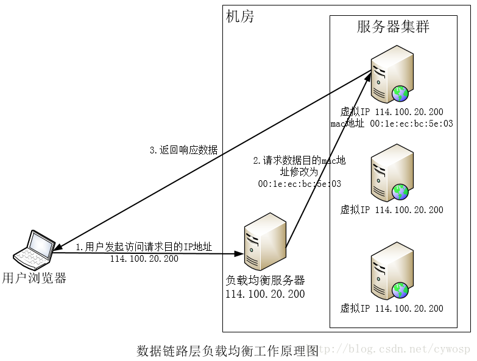
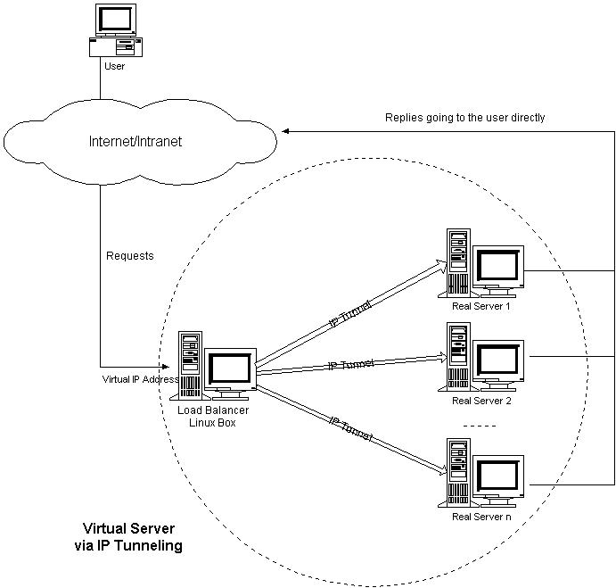
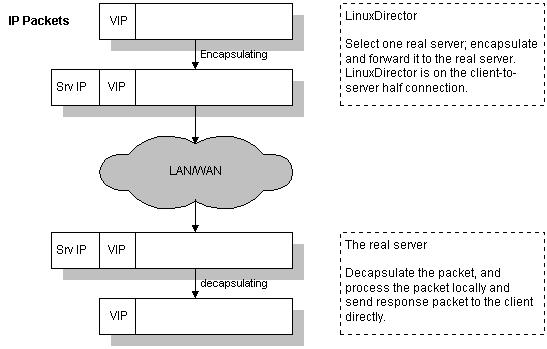

## 几种常见的负载均衡

### http重定向

HTTP重定向服务器就是一个普通的服务器，当用户访问时，其会根据一定的算法得到服务器集群的一个真实服务器的IP地址，将其放在HTTP响应头中，响应状态码为（302），当用户浏览器接收到这个响应时，会将得到的真实服务器的IP地址提出并重新访问。如上图所示，当用户访问域名时通过DNS解析得到114.100.20.200，然后访问114.100.20.200，也就是HTTP重定向服务器，响应重定向至114.100.20.203，用户浏览器再重新访问。

缺点：
1. 这种方式需要用户浏览器访问两次，性能较差 
2. HTTP重定向服务器会的处理能力会成为负载均衡的瓶颈 
3. HTTP重定向返回302，可能会使搜索引擎判定为SEO作弊，降低搜索排名

---

### dns域名解析（DNS:通过域名获取ip地址的手段）

当我们通过域名访问网站时，需要通过DNS服务器得到服务器的IP地址，我们可以在DNS服务器上设置一定的算法，每次得到不同的IP地址来进行访问从而实现负载均衡

如图，当用户访问www.apusapp.com时，这个域名对应了多个IP地址，通过DNS服务器解析会得到一个IP地址（可以看到，得到的这个IP地址，是服务器集群中一个服务器的IP地址），用户访问这个IP地址来达到真实的服务。

优点：
1. 将负载均衡的工作丢给了DNS服务器去做，省去了网站管理人员的维护工作
2. 对于真实地址的服务器，不需要做任何的配置
3. 简单易用，成本低，而且方便灵活
4. 服务器可以放在任何的地方
5. 同时，DNS服务还可以做基于地理位置的解析，可以让一个距离最近的服务器的IP地址放回，提高性能

缺点:
1. DNS服务是有多级的（之后有时间写一个详细的DNS服务介绍）
大致上来说，首先是在浏览器中有一个DNS缓存，如果找不到就在本机地址的hosts文件中查找，再找不到就去路由器缓存中查找。然后是本地DNS服务器，如果没有，就是根服务器，顶级服务器，权限域名服务器等等等。总之，在每一级都有可能缓存这DNS的对应关系，所以有可能当某一台真实服务器下线之后，修改了DNS服务器的记录，但在生效之前还有一段时间，在这段期间，其IP地址已经不可用了，通过域名进行访问时还是会访问到这个IP地址。会访问失败

2. DNS服务器和真实服务器是完全分开的，所以DNS的负载均衡不能监测到真是服务器当前的运行状态，其负载均衡的效果不是很好

3. 可能会造成额外的网络问题。为了使本DNS服务器和其他DNS服务器及时交互，保证DNS数据及时更新，使地址能随机分配，一般都要将DNS的刷新时间设置的较小，但太小将会使DNS流量大增造成额外的网络问题。

事实上，大型网站都将DNS负载均衡作为第一级的负载均衡手段，在服务器内部再进行第二级的负载均衡，也就是说，我们通过DNS得到的IP地址并不是真实服务器的IP地址，而是内部负载均衡服务器的IP地址。

---

### 反向代理

代理(用户端代理)与反向代理(服务器端代理)：VPN服务就是我们常用的一种代理（正向代理），用户将请教交给代理服务器，代理服务器访问网站获取数据，之后代理服务器再将数据返还给用户。在这个过程中，应用服务器并不知道用户的存在。只知道代理浏览器的访问。

`反向代理`是指在服务器端的代理，代理服务器接收用户的请求，再转发给真实服务器，之后再返回给代理服务器再给用户，在这个过程中，用户并不知道真实服务器的存在。

反向代理服务器管理了一组服务器，当用户访问时，代理服务器根据负载均衡算法将请求转发到真实服务器，真实服务器也通过反向代理服务器返还数据。内部服务器不对外部提供服务，所以不需要外部IP，而反向代理服务器需要两个网卡，一个IP用于外部用户访问使用，另外一个用于内部使用。

如上图所示，当用户发起访问，请求访问的ip地址是114.100.20.200，到达反向代理服务器时，根据负载均衡算法得到一个真实服务器的IP地址，并将用户请求转发到该服务器上，当真实服务器处理完之后将数据返回到反向代理服务器。反相代理服务器再将该响应的内容返回给用户。

优点：

* 反向代理服务器位于应用层，负载均衡方案和反向代理服务器集成在了一起，部署简单

缺点：

* 反向代理服务器用户处理所有的请求和响应，其性能可能成为服务器集群的瓶颈
* 有名Nginx就是反向代理服务

---

### IP层负载均衡

IP包结构

其中，可能看到有源地址和目的地址两项，这两项就是用来做IP层的负载均衡的关键。我们就是通过修改这两个地址来达到“转发”目的

如上图所示，当用户发起请求时（源地址为200.110.50.1），访问负载均衡服务器（目的地址为114.100.20.200），负载均衡服务器在内核进程获取网路数据包，根据一定的算法得到一个真实服务器的IP地址，其后将IP数据包的目的地址修改为该IP地址（192.168.1.1），之后就会将数据包发送到该真实服务器上去，之后再向负载均衡服务器返回数据，负载均衡服务器将源地址修改为114.100.20.200后返回给用户浏览器。

这个方法的关键就是因为只能在负载均衡服务器出修改源地址和目的地址，所以在真实服务器处理完之后要想办法将数据返回给负载均衡服务器而不是用户浏览器。 
比如，当用户发出请求时，目的地址是114.100.20.200，源地址是200.110.50.1，到达负载均衡服务器后，将目的地址该位192.168.1.1，源地址还是200.110.50.1，所以当真实服务器处理完之后的数据无法回到负载均衡服务器

解决方法：

1. 提供两个网卡，负载均衡服务器就有内部IP和外部IP两个IP，当请求到达负载均衡服务器时，修改目的地址，也修改源地址，将源地址修改为负载均衡服务器的内部IP，这样的话，真实服务器处理后的响应就会再次回到负载均衡服务器

2. 将负载均衡服务器作为真实服务器集群的网关服务器，这样的话所有的请求响应都要经过网关服务器

优点:

* IP负载均衡在内核进程完成数据分发，处理性能得到了很好的提高。

缺点:

* 由于所有请求和响应都要经过负载均衡服务器，集群的最大响应数据吞吐量将受到负载均衡服务器网卡带宽的限制，对于提供下载服务或者视频服务等需要大量传输数据的站点而言，这是难以满足需求的

---

### 链路层的负载均衡

MAC地址：mac地址是与网卡相关，其编号只与网卡生产厂商和流水号有关，基本上可以作为每台电脑的“身份证”。以太网中数据帧之间是通过MAC寻址来到达对应的计算机网卡或者路由的

链路层的负载均衡通过修改帧数据包中的MAC地址来达到转发的目的。这种方法，所有的真实服务器和负载均衡服务器都有相同的IP地址，不用修改IP数据包的目的地址和源地址，只通过修改MAC地址就可以达到效果，因为请求的IP地址和实际处理的真实服务器的IP地址一致，所以不需要回到负载均衡服务器进行地址交换，可以将响应直接发会给用户浏览器，避免了负载均衡服务器成为传输瓶颈的可能

----
## 实现负载均衡的几种方式

负载均衡(Load Balance)是集群技术（Cluster）的一种应用。负载均衡可以将工作任务分摊到多个处理单元，从而提高并发处理能力。目前最常见的负载均衡应用是Web负载均衡。根据实现的原理不同，常见的web负载均衡技术包括：DNS轮询、IP负载均衡和CDN。其中IP负载均衡可以使用硬件设备或软件方式来实现。

服务器集群(Cluster)使得多个服务器节点能够协同工作，根据目的的不同，服务器集群可以分为：

高性能集群：将单个重负载的请求分散到多个节点进行处理，最后再将处理结果进行汇总
高可用集群：提高冗余单元，避免单点故障
负载均衡集群：将大量的并发请求分担到多个处理节点。由于单个处理节点的故障不影响整个服务，负载均衡集群同时也实现了高可用性。
一般提到的负载均衡(Load Balance)，是指实现负载均衡集群。负载均衡实现了横向扩展（Scale Out），避免纵向的升级（Scale Up）换代。

本文中的web负载均衡，特指能够分担web请求（http，https等）的负载均衡技术。

### 基本原理

任何的负载均衡技术都要想办法建立某种一对多的映射机制：一个请求的入口映射到多个处理请求的节点，从而实现分而治之（Divide and Conquer）。

这种映射机制使得多个物理存在对外体现为一个虚拟的整体，对服务的请求者屏蔽了内部的结构。

采用不同的机制建立映射关系，可以形成不同的负载均衡技术，常见的包括：

* DNS轮询
* CDN
* IP负载均衡

### DNS

DNS轮询是最简单的负载均衡方式。以域名作为访问入口，通过配置多条DNS A记录使得请求可以分配到不同的服务器。

DNS轮询没有快速的健康检查机制，而且只支持WRR的调度策略导致负载很难“均衡”，通常用于要求不高的场景。并且DNS轮询方式直接将服务器的真实地址暴露给用户，不利于服务器安全。

### CDN

CDN（Content Delivery Network，内容分发网络）。通过发布机制将内容同步到大量的缓存节点，并在DNS服务器上进行扩展，找到里用户最近的缓存节点作为服务提供节点。

因为很难自建大量的缓存节点，所以通常使用CDN运营商的服务。目前国内的服务商很少，而且按流量计费，价格也比较昂贵

### IP负载均衡

IP负载均衡是基于特定的TCP/IP技术实现的负载均衡。比如NAT、DR、Turning等。是最经常使用的方式。关于其原理，可以参考下面另一篇文章：lvs中的负载均衡方式。

IP负载均衡可以使用硬件设备，也可以使用软件实现。硬件设备的主要产品是F5-BIG-IP-GTM（简称F5)，软件产品主要有LVS、HAProxy、NginX。其中LVS、HAProxy可以工作在4-7层，NginX工作在7层。关于三者的简单对比，可以参考这里。

硬件负载均衡设备可以将核心部分做成芯片，性能和稳定性更好，而且商用产品的可管理性、文档和服务都比较好。唯一的问题就是价格。

软件负载均衡通常是开源软件。自由度较高，但学习成本和管理成本会比较大。

### LVS
 
LVS(Linux Virtual Server, linux虚拟服务器），是章文嵩博士开发的开放软件，目前已经集成到Linux内核中。

基于不同的网络技术，LVS支持多种负载均衡机制。包括：VS/NAT（基于网络地址转换技术）、VS/TUN（基于IP隧道技术）和VS/DR（基于直接路由技术）。

此外，为了适应不同的需要，淘宝开发了VS/FULLNAT，从本质上来说也是基于网络地址转换技术。最近还有一个基于VS/FULLNAT的DNAT模块。

不管使用哪种机制，LVS都不直接处理请求，而是将请求转发到后面真正的服务器(Real Server)。不同的机制，决定了响应包如何返回到客户端。

### VS/NAT

NAT（Network Address Translation，网络地址转换）也叫做网络掩蔽或者IP掩蔽，是将IP 数据包头中的IP 地址转换为另一个IP 地址的过程。

NAT能够将私有（保留）地址转化为合法IP地址，通常用于一个公共IP地址和多个内部私有IP地址直接的映射，广泛应用于各种类型Internet接入方式和各种类型的网络中。

通过使用NAT将目的地址转换到多个服务器的方式，可以实现负载均衡，同时能够隐藏并保护内部服务器，避免来自网络外部的攻击。商用负载均衡设备如Cisco的LocalDirector、F5的Big/IP和Alteon的ACEDirector都是基于NAT方法。

VS/NAT(Virtual Server via Network Address Translation)是基于NAT技术实现负载均衡的方法。其架构如下图所示：

1. 客户通过Virtual IP Address（虚拟服务的IP地址）访问网络服务时，请求报文到达调度器
2. 调度器根据连接调度算法从一组真实服务器中选出一台服务器，将报文的目标地址Virtual IP Address改写成选定服务器的地址，报文的目标端口改写成选定服务器的相应端口，最后将修改后的报文发送给选出的服务器。

3. 真实的服务器处理请求，并将响应报文发到调度器。

4. 调度器将报文的源地址和源端口改为Virtual IP Address和相应的端口
5. 调度器将修改过的报文发给用户

在VS/NAT的集群系统中，请求和响应的数据报文都需要通过负载调度器，当真实服务器的数目在10台和20台之间时，负载调度器将成为整个集群系统的新瓶颈。大多数Internet服务都有这样的特点：请求报文较短而响应报文往往包含大量的数据。如果能将请求和响应分开处理，即在负载调度器中只负责调度请求而响应直接返回给客户，将极大地提高整个集群系统的吞吐量。比如IP隧道技术。

### VS/TUN

IP Tunneling(IP隧道)技术，又称为IP封装技术(IP encapsulation)，是一种在网络之间传递数据的方式。可以将一个IP报文封装到另一个IP报文（可能是不同的协议）中，并转发到另一个IP地址。IP隧道主要用于移动主机和虚拟私有网络（Virtual Private Network），在其中隧道都是静态建立的，隧道一端有一个IP地址，另一端也有唯一的IP地址。

VS/TUN（Virtual Server via IP Tunneling）是基于隧道技术实现负载均衡的方法。其架构如下图所示：

VS/TUN与VS/NAT的工作机制大体上相同，区别在于：

1. 调度器转发报文的时候进行了协议的二次封装，真实的服务器接收到请求后先进行解包。过程如下图所示：

2. 响应报文从后端服务器直接返回给客户，不需要经过调度器。

## 方法的优缺点比较

**VS/NAT**
* 优点
    * 对后端服务器的操作系统无要求
    * 只需要一个IP地址配置在调度器上，服务器组可以用私有的IP地址。
    * 支持端口映射
* 缺点
    * 请求和响应报文都需要通过调度器，伸缩能力有限（10+)
    * 要求服务器和调度器在同一个VLAN
    * 需要将服务器的默认网关指向调度器
    * 对于那些将IP地址或者端口号在报文数据中传送的网络服务，需要编写相应的应用模块来转换报文数据中的IP地址或者端口号

**VS/TUN**
* 优点

    * 不需要调度应答报文，性能高
    * 服务器和调度器可以不在同一个VLAN
    * 支持广域负载均衡

* 缺点
    * 所有的服务器必须支持“IP Tunneling”协议，要安装内核模块（比如IPIP等），配置复杂
    * 有建立IP隧道的开销
    * 服务器上直接绑定虚拟IP(Virtaul IP)，风险很大
    * 服务器需要联通外网
    * 不支持端口映射