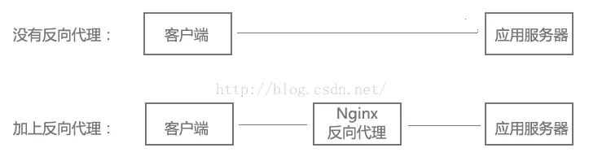
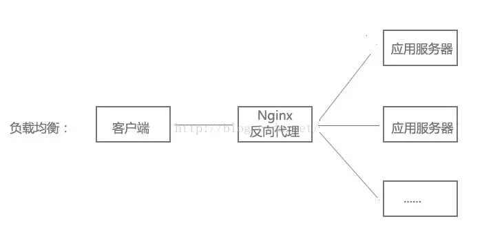
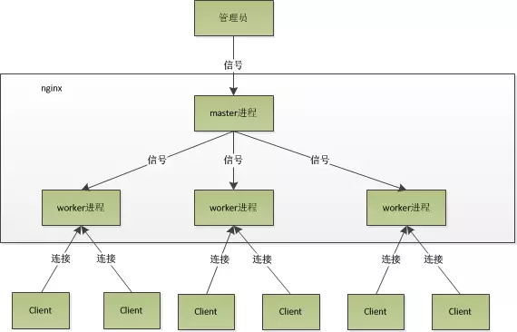
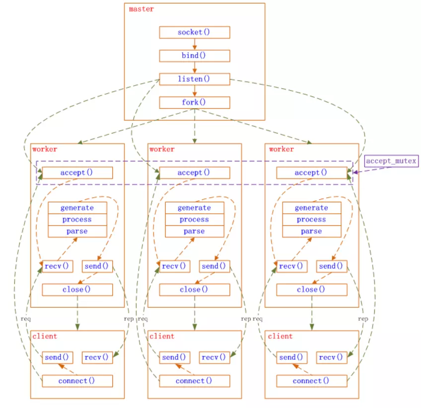
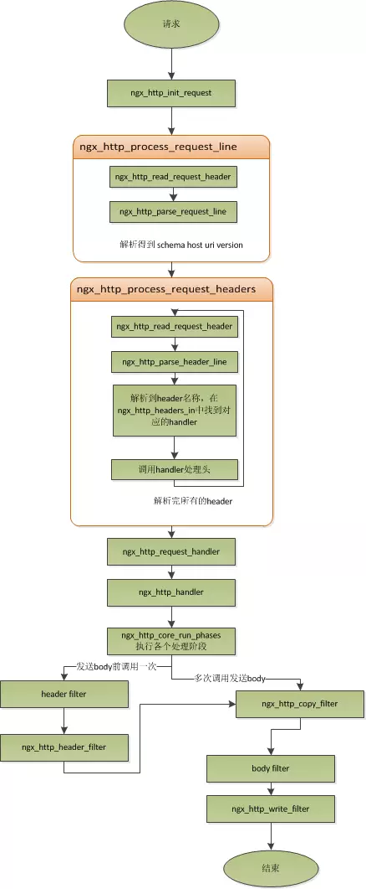

# Nginx从听说到学会
## 第一章 Nginx简介
### Nginx是什么

没有听过Nginx？那么一定听过它的“同行”Apache吧！Nginx同Apache一样都是一种WEB服务器。基于REST架构风格，以统一资源描述符(Uniform Resources Identifier)URI或者统一资源定位符(Uniform Resources Locator)URL作为沟通依据，通过HTTP协议提供各种网络服务。

然而，这些服务器在设计之初受到当时环境的局限，例如当时的用户规模，网络带宽，产品特点等局限并且各自的定位和发展都不尽相同。这也使得各个WEB服务器有着各自鲜明的特点。

Apache的发展时期很长，而且是毫无争议的世界第一大服务器。它有着很多有点：稳定、开源、跨平台等等。但是由于它出现的时间太长了。它兴起的年代，互联网产业远比不上现在。所以它被设计为一个重量级的。不支持高并发的服务器。在Apache上运行数以万计的并发访问，会导致服务器消耗大量内存。操作系统对其进行进程或线程间的切换也消耗了大量的CPU资源，导致HTTP请求的平均响应速度降低。

这些都决定了Apache不可能成为高性能WEB服务器，轻量级高并发服务器Nginx和Lighttpd就应运而生了。


### Nginx产生

又是拜大神的时候了，这次被选中的人是俄罗斯的工程师Igor Sysoev，他在为Rambler Media工作期间，使用C语言开发了Nginx。Nginx作为WEB服务器一直为Rambler Media提供出色而又稳定的服务。

然后呢，Igor Sysoev将Nginx代码开源，并且赋予自由软件许可证。

由于：

* Nginx使用基于事件驱动架构，使得其可以支持数以百万级别的TCP连接
* 高度的模块化和自由软件许可证是的第三方模块层出不穷（这是个开源的时代啊~）
* Nginx是一个跨平台服务器，可以运行在Linux, FreeBSD, Solaris, AIX, Mac OS, Windows等操作系统上
* 这些优秀的设计带来的极大的稳定性。
于是，duang的一下。Nginx火了。


### 三大WEB服务器对比
#### lighttpd

Lighttpd是一个具有非常低的内存开销，cpu占用率低，效能好，以及丰富的模块等特点。lighttpd是众多OpenSource轻量级的web server中较为优秀的一个。支持FastCGI, CGI, Auth, 输出压缩(output compress), URL重写, Alias等重要功能。

Lighttpd使用fastcgi方式运行PHP,它会使用很少的PHP进程响应很大的并发量。

Fastcgi的优点在于：

* 从稳定性上看, fastcgi是以独立的进程池运行来cgi,单独一个进程死掉,系统可以很轻易的丢弃,然后重新分配新的进程来运行逻辑.
* 从安全性上看, fastcgi和宿主的server完全独立, fastcgi怎么down也不会把server搞垮,
* 从性能上看, fastcgi把动态逻辑的处理从server中分离出来, 大负荷的IO处理还是留给宿主server, 这样宿主server可以一心一意作IO,对于一个普通的动态网页来说, 逻辑处理可能只有一小部分, 大量的图片等静态IO处理完全不需要逻辑程序的参与
* 从扩展性上讲, fastcgi是一个中立的技术标准, 完全可以支持任何语言写的处理程序php,Java,Python


#### Nginx

Nginx是俄罗斯人编写的十分轻量级的HTTP服务器,Nginx，它的发音为“engine X”， 是一个高性能的HTTP和反向代理服务器，同时也是一个IMAP/POP3/SMTP 代理服务器．Nginx是由俄罗斯人 Igor Sysoev为俄罗斯访问量第二的 Rambler.ru站点开发.

Nginx以事件驱动的方式编写，所以有非常好的性能，同时也是一个非常高效的反向代理、负载平衡。其拥有匹配 Lighttpd的性能，同时还没有Lighttpd的内存泄漏问题，而且Lighttpd的mod_proxy也有一些问题并且很久没有更新。但是Nginx并不支持cgi方式运行，原因是可以减少因此带来的一些程序上的漏洞。所以必须使用FastCGI方式来执行PHP程序。

nginx做为HTTP服务器，有以下几项基本特性：

* 处理静态文件，索引文件以及自动索引；打开文件描述符缓冲
* 无缓存的反向代理加速，简单的负载均衡和容错
* FastCGI，简单的负载均衡和容错
* 模块化的结构。包括gzipping, byte ranges, chunked responses,以及 SSI-filter等filter。如果由FastCGI或其它代理服务器处理单页中存在的多个SSI，则这项处理可以并行运行，而不需要相互等待。
Nginx专为性能优化而开发，性能是其最重要的考量,实现上非常注重效率。它支持内核Poll模型，能经受高负载的考验,有报告表明能支持高达 50,000个并发连接数。

Nginx具有很高的稳定性。其它HTTP服务器，当遇到访问的峰值，或者有人恶意发起慢速连接时，也很可能会导致服务器物理内存耗尽频繁交换，失去响应，只能重启服务器。例如当前apache一旦上到200个以上进程，web响应速度就明显非常缓慢了。而Nginx采取了分阶段资源分配技术，使得它的CPU与内存占用率非常低。nginx官方表示保持10,000个没有活动的连接，它只占2.5M内存，所以类似DOS这样的攻击对nginx来说基本上是毫无用处的。就稳定性而言,nginx比lighthttpd更胜一筹。

Nginx支持热部署。它的启动特别容易, 并且几乎可以做到7*24不间断运行，即使运行数个月也不需要重新启动。你还能够在不间断服务的情况下，对软件版本进行进行升级。

#### 三种服务器比较
|||||
-|-|-|-
server| Apache|	Nginx|	Lighttpd
Proxy代理|	非常好|	非常好|	一般
Rewriter|	好|	非常好|	一般
Fcgi|	不好|	好|	非常好
热部署|	不支持|	支持|	不支持
系统压力比较|	很大|	很小|	比较小
稳定性|	好|	非常好|	不好
安全性|	好|	一般|	一般
静态文件处理|	一般|	非常好|	好
反向代理|	一般|	非常好|	一般

## 第二章 Nginx基本概念

### 静态HTTP服务器
首先，Nginx是一个HTTP服务器，可以将服务器上的静态文件（如HTML、图片）通过HTTP协议展现给客户端。

配置：
```
server {
    listen 80; # 端口号
    location / {
        root /usr/share/nginx/html; # 静态文件路径
    }
}
```

### 反向代理服务器
什么是反向代理？

客户端本来可以直接通过HTTP协议访问某网站应用服务器，如果网站管理员在中间加上一个Nginx，客户端请求Nginx，Nginx请求应用服务器，然后将结果返回给客户端，此时Nginx就是反向代理服务器。



反向代理配置：
```
server {
    listen 80;
    location / {
        proxy_pass http://192.168.0.112:8080; # 应用服务器HTTP地址
    }
}
```
既然服务器可以直接HTTP访问，为什么要在中间加上一个反向代理，不是多此一举吗？反向代理有什么作用？继续往下看，下面的负载均衡、虚拟主机，都基于反向代理实现，当然反向代理的功能也不仅仅是这些。

### 负载均衡
当网站访问量非常大，也摊上事儿了。因为网站越来越慢，一台服务器已经不够用了。于是将相同的应用部署在多台服务器上，将大量用户的请求分配给多台机器处理。同时带来的好处是，其中一台服务器万一挂了，只要还有其他服务器正常运行，就不会影响用户使用。
Nginx可以通过反向代理来实现负载均衡。



负载均衡配置：
```
upstream myapp {
    server 192.168.0.111:8080; # 应用服务器1
    server 192.168.0.112:8080; # 应用服务器2
}
server {
    listen 80;
    location / {
        proxy_pass http://myweb;
    }
}
```

### 虚拟主机
有的网站访问量大，需要负载均衡。然而并不是所有网站都如此出色，有的网站，由于访问量太小，需要节省成本，将多个网站部署在同一台服务器上。

例如将www.aaa.com和www.bbb.com两个网站部署在同一台服务器上，两个域名解析到同一个IP地址，但是用户通过两个域名却可以打开两个完全不同的网站，互相不影响，就像访问两个服务器一样，所以叫两个虚拟主机。

配置：
```
server {
    listen 80 default_server;
    server_name _;
    return 444; # 过滤其他域名的请求，返回444状态码
}
server {
    listen 80;
    server_name www.aaa.com; # www.aaa.com域名
    location / {
        proxy_pass http://localhost:8080; # 对应端口号8080
    }
}
server {
    listen 80;
    server_name www.bbb.com; # www.bbb.com域名
    location / {
        proxy_pass http://localhost:8081; # 对应端口号8081
    }
}
```
在服务器8080和8081分别开了一个应用，客户端通过不同的域名访问，根据server_name可以反向代理到对应的应用服务器。

虚拟主机的原理是通过HTTP请求头中的Host是否匹配server_name来实现的，有兴趣的同学可以研究一下HTTP协议。

另外，server_name配置还可以过滤有人恶意将某些域名指向你的主机服务器

## 第三章 初探nginx架构
### 进程模型

众所周知，nginx性能高，而nginx的高性能与其架构是分不开的。那么nginx究竟是怎么样的呢？这一节我们先来初识一下nginx框架吧。

nginx在启动后，在unix系统中会以daemon的方式在后台运行，后台进程包含一个master进程和多个worker进程。我们也可以手动地关掉后台模式，让nginx在前台运行，并且通过配置让nginx取消master进程，从而可以使nginx以单进程方式运行。

很显然，生产环境下我们肯定不会这么做，所以关闭后台模式，一般是用来调试用的，在后面的章节里面，我们会详细地讲解如何调试nginx。所以，我们可以看到，nginx是以多进程的方式来工作的，当然nginx也是支持多线程的方式的，只是我们主流的方式还是多进程的方式，也是nginx的默认方式。nginx采用多进程的方式有诸多好处，所以我就主要讲解nginx的多进程模式吧。

刚才讲到，nginx在启动后，会有一个master进程和多个worker进程。

master进程主要用来管理worker进程，包含：接收来自外界的信号，向各worker进程发送信号，监控worker进程的运行状态，当worker进程退出后(异常情况下)，会自动重新启动新的worker进程。而基本的网络事件，则是放在worker进程中来处理了。多个worker进程之间是对等的，他们同等竞争来自客户端的请求，各进程互相之间是独立的。一个请求，只可能在一个worker进程中处理，一个worker进程，不可能处理其它进程的请求。worker进程的个数是可以设置的，一般我们会设置与机器cpu核数一致，这里面的原因与nginx的进程模型以及事件处理模型是分不开的。nginx的进程模型，可以由下图来表示：



### nginx进程操作 
在nginx启动后，如果我们要操作nginx，要怎么做呢？

从上文中我们可以看到，master来管理worker进程，所以我们只需要与master进程通信就行了。master进程会接收来自外界发来的信号，再根据信号做不同的事情。所以我们要控制nginx，只需要通过kill向master进程发送信号就行了。

比如kill -HUP pid，则是告诉nginx，从容地重启nginx，我们一般用这个信号来重启nginx，或重新加载配置，因为是从容地重启，因此服务是不中断的。

master进程在接收到HUP信号后是怎么做的呢？首先master进程在接到信号后，会先重新加载配置文件，然后再启动新的worker进程，并向所有老的worker进程发送信号，告诉他们可以光荣退休了。新的worker在启动后，就开始接收新的请求，而老的worker在收到来自master的信号后，就不再接收新的请求，并且在当前进程中的所有未处理完的请求处理完成后，再退出。

当然，直接给master进程发送信号，这是比较老的操作方式，nginx在0.8版本之后，引入了一系列命令行参数，来方便我们管理。比如，./nginx -s reload，就是来重启nginx，./nginx -s stop，就是来停止nginx的运行。如何做到的呢？我们还是拿reload来说，我们看到，执行命令时，我们是启动一个新的nginx进程，而新的nginx进程在解析到reload参数后，就知道我们的目的是控制nginx来重新加载配置文件了，它会向master进程发送信号，然后接下来的动作，就和我们直接向master进程发送信号一样了。

### 事件模型
现在，我们知道了当我们在操作nginx的时候，nginx内部做了些什么事情，那么，worker进程又是如何处理请求的呢？我们前面有提到，worker进程之间是平等的，每个进程，处理请求的机会也是一样的。当我们提供80端口的http服务时，一个连接请求过来，每个进程都有可能处理这个连接，怎么做到的呢？

首先，每个worker进程都是从master进程fork过来，在master进程里面，先建立好需要listen的socket（listenfd）之后，然后再fork出多个worker进程。所有worker进程的listenfd会在新连接到来时变得可读，为保证只有一个进程处理该连接，所有worker进程在注册listenfd读事件前抢accept_mutex，抢到互斥锁的那个进程注册listenfd读事件，在读事件里调用accept接受该连接。当一个worker进程在accept这个连接之后，就开始读取请求，解析请求，处理请求，产生数据后，再返回给客户端，最后才断开连接，这样一个完整的请求就是这样的了。我们可以看到，一个请求，完全由worker进程来处理，而且只在一个worker进程中处理。

那么，nginx采用这种进程模型有什么好处呢？当然，好处肯定会很多了。首先，对于每个worker进程来说，独立的进程，不需要加锁，所以省掉了锁带来的开销，同时在编程以及问题查找时，也会方便很多。其次，采用独立的进程，可以让互相之间不会影响，一个进程退出后，其它进程还在工作，服务不会中断，master进程则很快启动新的worker进程。当然，worker进程的异常退出，肯定是程序有bug了，异常退出，会导致当前worker上的所有请求失败，不过不会影响到所有请求，所以降低了风险。当然，好处还有很多，大家可以慢慢体会。

### nginx事件处理
上面讲了很多关于nginx的进程模型，接下来，我们来看看nginx是如何处理事件的。

有人可能要问了，nginx采用多worker的方式来处理请求，每个worker里面只有一个主线程，那能够处理的并发数很有限啊，多少个worker就能处理多少个并发，何来高并发呢？非也，这就是nginx的高明之处，nginx采用了异步非阻塞的方式来处理请求，也就是说，nginx是可以同时处理成千上万个请求的。

想想apache的常用工作方式（apache也有异步非阻塞版本，但因其与自带某些模块冲突，所以不常用），每个请求会独占一个工作线程，当并发数上到几千时，就同时有几千的线程在处理请求了。这对操作系统来说，是个不小的挑战，线程带来的内存占用非常大，线程的上下文切换带来的cpu开销很大，自然性能就上不去了，而这些开销完全是没有意义的。

为什么nginx可以采用异步非阻塞的方式来处理呢，或者异步非阻塞到底是怎么回事呢？

我们先回到原点，看看一个请求的完整过程。首先，请求过来，要建立连接，然后再接收数据，接收数据后，再发送数据。具体到系统底层，就是读写事件，而当读写事件没有准备好时，必然不可操作，如果不用非阻塞的方式来调用，那就得阻塞调用了，事件没有准备好，那就只能等了，等事件准备好了，你再继续吧。

阻塞调用会进入内核等待，cpu就会让出去给别人用了，对单线程的worker来说，显然不合适，当网络事件越多时，大家都在等待呢，cpu空闲下来没人用，cpu利用率自然上不去了，更别谈高并发了。好吧，你说加进程数，这跟apache的线程模型有什么区别，注意，别增加无谓的上下文切换。所以，在nginx里面，最忌讳阻塞的系统调用了。

不要阻塞，那就非阻塞喽。非阻塞就是，事件没有准备好，马上返回EAGAIN，告诉你，事件还没准备好呢，你慌什么，过会再来吧。好吧，你过一会，再来检查一下事件，直到事件准备好了为止，在这期间，你就可以先去做其它事情，然后再来看看事件好了没。虽然不阻塞了，但你得不时地过来检查一下事件的状态，你可以做更多的事情了，但带来的开销也是不小的。

所以，才会有了异步非阻塞的事件处理机制，具体到系统调用就是像select/poll/epoll/kqueue这样的系统调用。它们提供了一种机制，让你可以同时监控多个事件，调用他们是阻塞的，但可以设置超时时间，在超时时间之内，如果有事件准备好了，就返回。

这种机制正好解决了我们上面的两个问题，拿epoll为例(在后面的例子中，我们多以epoll为例子，以代表这一类函数)，当事件没准备好时，放到epoll里面，事件准备好了，我们就去读写，当读写返回EAGAIN时，我们将它再次加入到epoll里面。这样，只要有事件准备好了，我们就去处理它，只有当所有事件都没准备好时，才在epoll里面等着。这样，我们就可以并发处理大量的并发了，当然，这里的并发请求，是指未处理完的请求，线程只有一个，所以同时能处理的请求当然只有一个了，只是在请求间进行不断地切换而已，切换也是因为异步事件未准备好，而主动让出的。这里的切换是没有任何代价，你可以理解为循环处理多个准备好的事件，事实上就是这样的。

与多线程相比，这种事件处理方式是有很大的优势的，不需要创建线程，每个请求占用的内存也很少，没有上下文切换，事件处理非常的轻量级。并发数再多也不会导致无谓的资源浪费（上下文切换）。更多的并发数，只是会占用更多的内存而已。 我之前有对连接数进行过测试，在24G内存的机器上，处理的并发请求数达到过200万。现在的网络服务器基本都采用这种方式，这也是nginx性能高效的主要原因。

我们之前说过，推荐设置worker的个数为cpu的核数，在这里就很容易理解了，更多的worker数，只会导致进程来竞争cpu资源了，从而带来不必要的上下文切换。而且，nginx为了更好的利用多核特性，提供了cpu亲缘性的绑定选项，我们可以将某一个进程绑定在某一个核上，这样就不会因为进程的切换带来cache的失效。像这种小的优化在nginx中非常常见，同时也说明了nginx作者的苦心孤诣。比如，nginx在做4个字节的字符串比较时，会将4个字符转换成一个int型，再作比较，以减少cpu的指令数等等。

现在，知道了nginx为什么会选择这样的进程模型与事件模型了。对于一个基本的web服务器来说，事件通常有三种类型，网络事件、信号、定时器。从上面的讲解中知道，网络事件通过异步非阻塞可以很好的解决掉。如何处理信号与定时器？

首先，信号的处理。对nginx来说，有一些特定的信号，代表着特定的意义。信号会中断掉程序当前的运行，在改变状态后，继续执行。如果是系统调用，则可能会导致系统调用的失败，需要重入。关于信号的处理，大家可以学习一些专业书籍，这里不多说。对于nginx来说，如果nginx正在等待事件（epoll_wait时），如果程序收到信号，在信号处理函数处理完后，epoll_wait会返回错误，然后程序可再次进入epoll_wait调用。

另外，再来看看定时器。由于epoll_wait等函数在调用的时候是可以设置一个超时时间的，所以nginx借助这个超时时间来实现定时器。nginx里面的定时器事件是放在一颗维护定时器的红黑树里面，每次在进入epoll_wait前，先从该红黑树里面拿到所有定时器事件的最小时间，在计算出epoll_wait的超时时间后进入epoll_wait。

所以，当没有事件产生，也没有中断信号时，epoll_wait会超时，也就是说，定时器事件到了。这时，nginx会检查所有的超时事件，将他们的状态设置为超时，然后再去处理网络事件。由此可以看出，当我们写nginx代码时，在处理网络事件的回调函数时，通常做的第一个事情就是判断超时，然后再去处理网络事件。
我们可以用一段伪代码来总结一下nginx的事件处理模型：

```
while (true) { 
    for t in run_tasks: t.handler(); 
    update_time(&now); 
    timeout = ETERNITY; 
    for t in wait_tasks: { /* sorted already */ 
        if (t.time <= now) { 
            t.timeout_handler();
        } else { 
            timeout = t.time - now; 
            break; 
        } 
        nevents = poll_function(events,timeout); 
        for i in nevents: 
            task t; 
        if (events[i].type == READ) {
            t.handler = read_handler; 
        } else {
            /* events[i].type == WRITE */ t.handler = write_handler; 
        } 
        run_tasks_add(t);
    }
}
```

#### Master进程工作原理

Master 进程的工作包括
* 接收来自外界的信号
* 向各worker进程发送信号
* 监控worker进程的运行状态，当worker进程退出后(异常情况下)，会自动重新启动新的worker进程

#### 惊群现象
惊群现象:当listen_fd有新的accept()请求过来,操作系统会唤醒所有子进程,因为这些进程都epoll_wait()同一个listen_fd,操作系统又无从判断由谁来负责accept,索性干脆全部叫醒,但最终只会有一个进程成功accept,其他进程accept失败.所有子进程都是被"吓醒"的,所以称之为Thundering Herd(惊群).

Nginx解决惊群的思路:避免惊群.
使用全局互斥锁(accept_mutex on),每个工作进程在epoll_wait()之前先去申请锁,申请到则继续处理,获取不到则等待,并设置了一个负载均衡的算法(当某一个工作进程的任务量达到总设置量的7/8时,则不会再尝试去申请锁)来均衡各个进程的任务量.

#### Worker进程工作原理
当一个worker进程在accept这个连接之后，就开始读取请求，解析请求，处理请求，产生数据后，再返回给客户端，最后才断开连接，这样一个完整的请求就是这样的了。我们可以看到，一个请求，完全由worker进程来处理，而且只在一个worker进程中处理。

采用这种方式的好处：

* 节省锁带来的开销。对于每个worker进程来说，独立的进程，不需要加锁，所以省掉了锁带来的开销，同时在编程以及问题查上时，也会方便很多
* 独立进程，减少风险。采用独立的进程，可以让互相之间不会影响，一个进程退出后，其它进程还在工作，服务不会中断，master进程则很快重新启动新的worker进程
* 在一次请求里无需进程切换

#### 事件模块
一个请求的基本过程：建立连接 - 接受连接 - 发送数据，在系统底层就是读写事件。

#### Epoll 模型
Epoll出现在 linux2.6以后，Nginx采用 Epoll 这种异步非阻塞的事件处理机制。这种机制的原理就是把一个完整的请求，划分成多个事件，比如accept（）， recv（），磁盘I/O，send（），每个事件都有不同的模块进行处理。一个请求由一个worker进程处理，在请求多的时候，无需频繁的切换进程。



* master进程先建好需要listen的socket后，然后再fork出多个woker进程，这样每个work进程都可以去accept这个socket
* 当一个client连接到来时，所有accept的work进程都会受到通知，但只有一个进程可以accept成功，其它的则会accept失败，Nginx提供了一把共享锁accept_mutex来保证同一时刻只有一个work进程在accept连接，从而解决惊群问题
* 当一个worker进程accept这个连接后，就开始读取请求，解析请求，处理请求，产生数据后，再返回给客户端，最后才断开连接，这样一个完成的请求就结束了
>Epoll 是基于一个进程处理多个连接、非阻塞IO的策略，Nginx多使用这种策略。

#### Select 模型

Select 模型在启动的时候创建多个进程，放在一个进程池里，并且进程池里的进程数会随着请求数目的增加而增加，对于每一个连接，都是在一个进程内处理完毕。所以Select模型能接收的并发量受到所能开启的进程数影响，进程之间是互相阻塞的，且频繁的切换进程造成大量开销。

>Select 是基于一个线程处理一个请求的非阻塞IO的策略，Apache使用这种策略。

### nginx基础概念
#### connection
在nginx中connection就是对tcp连接的封装，其中包括连接的socket，读事件，写事件。利用nginx封装的connection，我们可以很方便的使用nginx来处理与连接相关的事情，比如，建立连接，发送与接受数据等。而nginx中的http请求的处理就是建立在connection之上的，所以nginx不仅可以作为一个web服务器，也可以作为邮件服务器。当然，利用nginx提供的connection，我们可以与任何后端服务打交道。

结合一个tcp连接的生命周期，我们看看nginx是如何处理一个连接的。首先，nginx在启动时，会解析配置文件，得到需要监听的端口与ip地址，然后在nginx的master进程里面，先初始化好这个监控的socket(创建socket，设置addrreuse等选项，绑定到指定的ip地址端口，再listen)，然后再fork出多个子进程出来，然后子进程会竞争accept新的连接。此时，客户端就可以向nginx发起连接了。当客户端与服务端通过三次握手建立好一个连接后，nginx的某一个子进程会accept成功，得到这个建立好的连接的socket，然后创建nginx对连接的封装，即ngx_connection_t结构体。接着，设置读写事件处理函数并添加读写事件来与客户端进行数据的交换。最后，nginx或客户端来主动关掉连接，到此，一个连接就寿终正寝了。

当然，nginx也是可以作为客户端来请求其它server的数据的（如upstream模块），此时，与其它server创建的连接，也封装在ngx_connection_t中。作为客户端，nginx先获取一个ngx_connection_t结构体，然后创建socket，并设置socket的属性（ 比如非阻塞）。然后再通过添加读写事件，调用connect/read/write来调用连接，最后关掉连接，并释放ngx_connection_t。

在nginx中，每个进程会有一个连接数的最大上限，这个上限与系统对fd的限制不一样。在操作系统中，通过ulimit -n，我们可以得到一个进程所能够打开的fd的最大数，即nofile，因为每个socket连接会占用掉一个fd，所以这也会限制我们进程的最大连接数，当然也会直接影响到我们程序所能支持的最大并发数，当fd用完后，再创建socket时，就会失败。

nginx通过设置worker_connectons来设置每个进程支持的最大连接数。如果该值大于nofile，那么实际的最大连接数是nofile，nginx会有警告。nginx在实现时，是通过一个连接池来管理的，每个worker进程都有一个独立的连接池，连接池的大小是worker_connections。这里的连接池里面保存的其实不是真实的连接，它只是一个worker_connections大小的一个ngx_connection_t结构的数组。并且，nginx会通过一个链表free_connections来保存所有的空闲ngx_connection_t，每次获取一个连接时，就从空闲连接链表中获取一个，用完后，再放回空闲连接链表里面。

在这里，很多人会误解worker_connections这个参数的意思，认为这个值就是nginx所能建立连接的最大值。其实不然，这个值是表示每个worker进程所能建立连接的最大值，所以，一个nginx能建立的最大连接数，应该是worker_connections * worker_processes。当然，这里说的是最大连接数，对于HTTP请求本地资源来说，能够支持的最大并发数量是worker_connections * worker_processes，而如果是HTTP作为反向代理来说，最大并发数量应该是worker_connections * worker_processes/2。因为作为反向代理服务器，每个并发会建立与客户端的连接和与后端服务的连接，会占用两个连接。

那么，我们前面有说过一个客户端连接过来后，多个空闲的进程，会竞争这个连接，很容易看到，这种竞争会导致不公平，如果某个进程得到accept的机会比较多，它的空闲连接很快就用完了，如果不提前做一些控制，当accept到一个新的tcp连接后，因为无法得到空闲连接，而且无法将此连接转交给其它进程，最终会导致此tcp连接得不到处理，就中止掉了。很显然，这是不公平的，有的进程有空余连接，却没有处理机会，有的进程因为没有空余连接，却人为地丢弃连接。

那么，如何解决这个问题呢？首先，nginx的处理得先打开accept_mutex选项，此时，只有获得了accept_mutex的进程才会去添加accept事件，也就是说，nginx会控制进程是否添加accept事件。nginx使用一个叫ngx_accept_disabled的变量来控制是否去竞争accept_mutex锁。

在第一段代码中，计算ngx_accept_disabled的值，这个值是nginx单进程的所有连接总数的八分之一，减去剩下的空闲连接数量，得到的这个ngx_accept_disabled有一个规律，当剩余连接数小于总连接数的八分之一时，其值才大于0，而且剩余的连接数越小，这个值越大。

再看第二段代码，当ngx_accept_disabled大于0时，不会去尝试获取accept_mutex锁，并且将ngx_accept_disabled减1，于是，每次执行到此处时，都会去减1，直到小于0。不去获取accept_mutex锁，就是等于让出获取连接的机会，很显然可以看出，当空余连接越少时，ngx_accept_disable越大，于是让出的机会就越多，这样其它进程获取锁的机会也就越大。不去accept，自己的连接就控制下来了，其它进程的连接池就会得到利用，这样，nginx就控制了多进程间连接的平衡了。

```
ngx_accept_disabled = ngx_cycle->connection_n / 8
    - ngx_cycle->free_connection_n;

if (ngx_accept_disabled > 0) {
    ngx_accept_disabled--;

} else {
    if (ngx_trylock_accept_mutex(cycle) == NGX_ERROR) {
        return;
    }

    if (ngx_accept_mutex_held) {
        flags |= NGX_POST_EVENTS;

    } else {
        if (timer == NGX_TIMER_INFINITE
                || timer > ngx_accept_mutex_delay)
        {
            timer = ngx_accept_mutex_delay;
        }
    }
}
```

#### request
这节我们讲request，在nginx中我们指的是http请求，具体到nginx中的数据结构是ngx_http_request_t。ngx_http_request_t是对一个http请求的封装。 我们知道，一个http请求，包含请求行、请求头、请求体、响应行、响应头、响应体。

http请求是典型的请求-响应类型的的网络协议，而http是文件协议，所以我们在分析请求行与请求头，以及输出响应行与响应头，往往是一行一行的进行处理。如果我们自己来写一个http服务器，通常在一个连接建立好后，客户端会发送请求过来。然后我们读取一行数据，分析出请求行中包含的method、uri、http_version信息。然后再一行一行处理请求头，并根据请求method与请求头的信息来决定是否有请求体以及请求体的长度，然后再去读取请求体。得到请求后，我们处理请求产生需要输出的数据，然后再生成响应行，响应头以及响应体。在将响应发送给客户端之后，一个完整的请求就处理完了。

当然这是最简单的webserver的处理方式，其实nginx也是这样做的，只是有一些小小的区别，比如，当请求头读取完成后，就开始进行请求的处理了。nginx通过ngx_http_request_t来保存解析请求与输出响应相关的数据。

那接下来，简要讲讲nginx是如何处理一个完整的请求的。对于nginx来说，一个请求是从ngx_http_init_request开始的，在这个函数中，会设置读事件为ngx_http_process_request_line，也就是说，接下来的网络事件，会由ngx_http_process_request_line来执行。

从ngx_http_process_request_line的函数名，我们可以看到，这就是来处理请求行的，正好与之前讲的，处理请求的第一件事就是处理请求行是一致的。通过ngx_http_read_request_header来读取请求数据。然后调用ngx_http_parse_request_line函数来解析请求行。nginx为提高效率，采用状态机来解析请求行，而且在进行method的比较时，没有直接使用字符串比较，而是将四个字符转换成一个整型，然后一次比较以减少cpu的指令数，这个前面有说过。

很多人可能很清楚一个请求行包含请求的方法，uri，版本，却不知道其实在请求行中，也是可以包含有host的。比如一个请求GET http://www.taobao.com/uri HTTP/1.0这样一个请求行也是合法的，而且host是www.taobao.com，这个时候，nginx会忽略请求头中的host域，而以请求行中的这个为准来查找虚拟主机。另外，对于对于http0.9版来说，是不支持请求头的，所以这里也是要特别的处理。所以，在后面解析请求头时，协议版本都是1.0或1.1。整个请求行解析到的参数，会保存到ngx_http_request_t结构当中。

在解析完请求行后，nginx会设置读事件的handler为ngx_http_process_request_headers，然后后续的请求就在ngx_http_process_request_headers中进行读取与解析。ngx_http_process_request_headers函数用来读取请求头，跟请求行一样，还是调用ngx_http_read_request_header来读取请求头，调用ngx_http_parse_header_line来解析一行请求头，解析到的请求头会保存到ngx_http_request_t的域headers_in中，headers_in是一个链表结构，保存所有的请求头。而HTTP中有些请求是需要特别处理的，这些请求头与请求处理函数存放在一个映射表里面，即ngx_http_headers_in，在初始化时，会生成一个hash表，当每解析到一个请求头后，就会先在这个hash表中查找，如果有找到，则调用相应的处理函数来处理这个请求头。比如:Host头的处理函数是ngx_http_process_host。

当nginx解析到两个回车换行符时，就表示请求头的结束，此时就会调用ngx_http_process_request来处理请求了。ngx_http_process_request会设置当前的连接的读写事件处理函数为ngx_http_request_handler，然后再调用ngx_http_handler来真正开始处理一个完整的http请求。

这里可能比较奇怪，读写事件处理函数都是ngx_http_request_handler，其实在这个函数中，会根据当前事件是读事件还是写事件，分别调用ngx_http_request_t中的read_event_handler或者是write_event_handler。由于此时，我们的请求头已经读取完成了，之前有说过，nginx的做法是先不读取请求body，所以这里面我们设置read_event_handler为ngx_http_block_reading，即不读取数据了。

刚才说到，真正开始处理数据，是在ngx_http_handler这个函数里面，这个函数会设置write_event_handler为ngx_http_core_run_phases，并执行ngx_http_core_run_phases函数。ngx_http_core_run_phases这个函数将执行多阶段请求处理，nginx将一个http请求的处理分为多个阶段，那么这个函数就是执行这些阶段来产生数据。因为ngx_http_core_run_phases最后会产生数据，所以我们就很容易理解，为什么设置写事件的处理函数为ngx_http_core_run_phases了。

在这里，我简要说明了一下函数的调用逻辑，我们需要明白最终是调用ngx_http_core_run_phases来处理请求，产生的响应头会放在ngx_http_request_t的headers_out中，这一部分内容，我会放在请求处理流程里面去讲。nginx的各种阶段会对请求进行处理，最后会调用filter来过滤数据，对数据进行加工，如truncked传输、gzip压缩等。

这里的filter包括header filter与body filter，即对响应头或响应体进行处理。filter是一个链表结构，分别有header filter与body filter，先执行header filter中的所有filter，然后再执行body filter中的所有filter。在header filter中的最后一个filter，即ngx_http_header_filter，这个filter将会遍历所有的响应头，最后需要输出的响应头在一个连续的内存，然后调用ngx_http_write_filter进行输出。ngx_http_write_filter是body filter中的最后一个，所以nginx首先的body信息，在经过一系列的body filter之后，最后也会调用ngx_http_write_filter来进行输出(有图来说明)。

这里要注意的是，nginx会将整个请求头都放在一个buffer里面，这个buffer的大小通过配置项client_header_buffer_size来设置，如果用户的请求头太大，这个buffer装不下，那nginx就会重新分配一个新的更大的buffer来装请求头，这个大buffer可以通过large_client_header_buffers来设置，这个large_buffer这一组buffer，比如配置4 8k，就是表示有四个8k大小的buffer可以用。

注意，为了保存请求行或请求头的完整性，一个完整的请求行或请求头，需要放在一个连续的内存里面，所以，一个完整的请求行或请求头，只会保存在一个buffer里面。这样，如果请求行大于一个buffer的大小，就会返回414错误，如果一个请求头大小大于一个buffer大小，就会返回400错误。在了解了这些参数的值，以及nginx实际的做法之后，在应用场景，我们就需要根据实际的需求来调整这些参数，来优化我们的程序了。

处理流程图：

