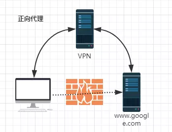
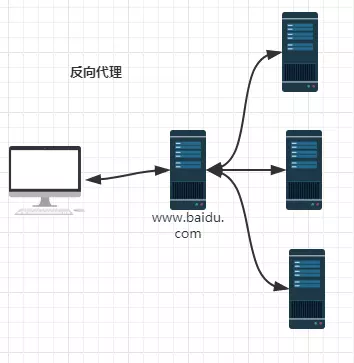
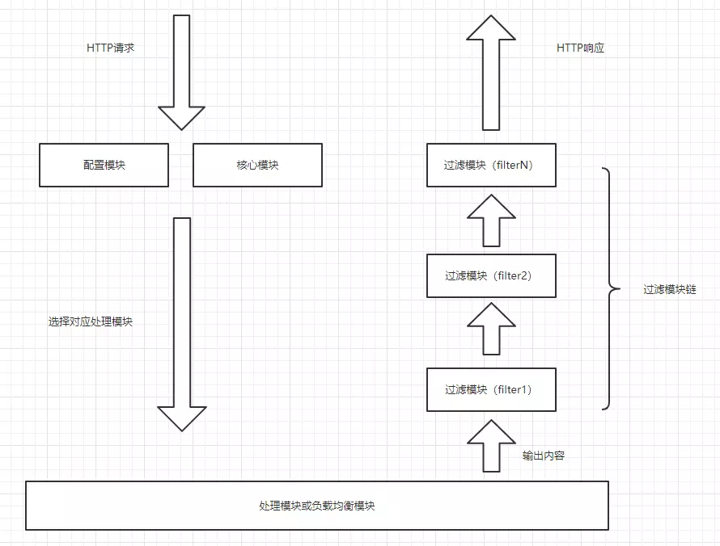
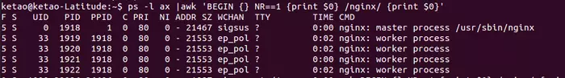
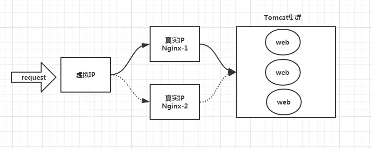
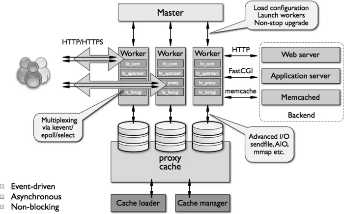
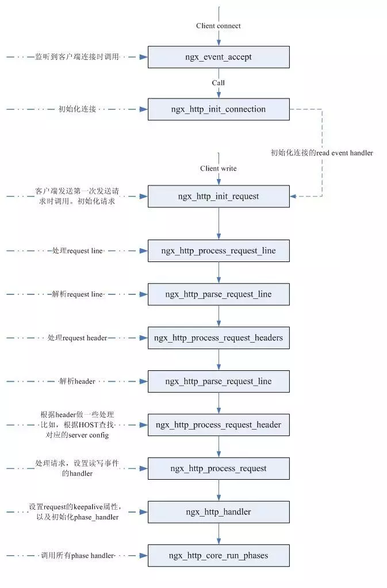
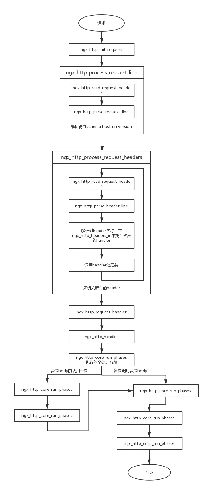

## 理解Nginx工作原理

### 反向代理
#### 概念
> 反向代理（Reverse Proxy）方式是指以代理服务器来接受internet上的连接请求，然后将请求转发给内部网络上的服务器，并将从服务器上得到的结果返回给internet上请求连接的客户端，此时代理服务器对外就表现为一个服务器。

> 举个例子，比如我想访问 http://www.test.com/readme，但www.test.com上并不存在readme页面，于是他是偷偷从另外一台服务器上取回来，然后作为自己的内容返回用户，但用户并不知情。这里所提到的 www.test.com 这个域名对应的服务器就设置了反向代理功能。

> 结论就是，反向代理服务器对于客户端而言它就像是原始服务器，并且客户端不需要进行任何特别的设置。客户端向反向代理的命名空间(name-space)中的内容发送普通请求，接着反向代理服务器将判断向何处(原始服务器)转交请求，并将获得的内容返回给客户端，就像这些内容原本就是它自己的一样。

> 正向代理，既然有反向代理，就肯定有正向代理。什么叫正向代理呢？

> 正向代理（Forward Proxy）通常都被简称为代理，就是在用户无法正常访问外部资源，比方说受到GFW的影响无法访问twitter的时候，我们可以通过代理的方式，让用户绕过防火墙，从而连接到目标网络或者服务。

> 正向代理的工作原理就像一个跳板，比如：我访问不了google.com，但是我能访问一个代理服务器A，A能访问google.com，于是我先连上代理服务器A，告诉他我需要google.com的内容，A就去取回来，然后返回给我。从网站的角度，只在代理服务器来取内容的时候有一次记录，有时候并不知道是用户的请求，也隐藏了用户的资料，这取决于代理告不告诉网站。

> 结论就是，正向代理是一个位于客户端和原始服务器(origin server)之间的服务器。为了从原始服务器取得内容，客户端向代理发送一个请求并指定目标(原始服务器)，然后代理向原始服务器转交请求并将获得的内容返回给客户端。

反向代理VS正向代理：

#### 工作流程

1. 用户通过域名发出访问Web服务器的请求，该域名被DNS服务器解析为反向代理服务器的IP地址；

2. 反向代理服务器接受用户的请求；

3. 反向代理服务器在本地缓存中查找请求的内容，找到后直接把内容发送给用户；

4. 如果本地缓存里没有用户所请求的信息内容，反向代理服务器会代替用户向源服务器请求同样的信息内容，并把信息内容发给用户，如果信息内容是缓存的还会把它保存到缓存中。

#### 优点

保护了真实的web服务器，保证了web服务器的资源安全

>通常的代理服务器，只用于代理内部网络对Internet外部网络的连接请求，客户机必须指定代理服务器，并将本来要直接发送到Web服务器上的http请求发送到代理服务器中。不支持外部网络对内部网络的连接请求，因为内部网络对外部网络是不可见的。当一个代理服务器能够代理外部网络上的主机，访问内部网络时，这种代理服务的方式称为反向代理服务。此时代理服务器对外就表现为一个Web服务器，外部网络就可以简单把它当作一个标准的Web服务器而不需要特定的配置。不同之处在于，这个服务器没有保存任何网页的真实数据，所有的静态网页或者CGI程序，都保存在内部的Web服务器上。因此对反向代理服务器的攻击并不会使得网页信息遭到破坏，这样就增强了Web服务器的安全性。

节约了有限的IP地址资源

>企业内所有的网站共享一个在internet中注册的IP地址，这些服务器分配私有地址，采用虚拟主机的方式对外提供服务。

减少WEB服务器压力，提高响应速度

>反向代理就是通常所说的web服务器加速，它是一种通过在繁忙的web服务器和外部网络之间增加一个高速的web缓冲服务器来降低实际的web服务器的负载的一种技术。反向代理是针对web服务器提高加速功能，作为代理缓存，它并不是针对浏览器用户，而针对一台或多台特定的web服务器，它可以代理外部网络对内部网络的访问请求。

>反向代理服务器会强制将外部网络对要代理的服务器的访问经过它，这样反向代理服务器负责接收客户端的请求，然后到源服务器上获取内容，把内容返回给用户，并把内容保存到本地，以便日后再收到同样的信息请求时，它会把本地缓存里的内容直接发给用户，以减少后端web服务器的压力，提高响应速度。因此Nginx还具有缓存功能。

其他优点

1. 请求的统一控制，包括设置权限、过滤规则等；

2. 区分动态和静态可缓存内容；

3. 实现负载均衡，内部可以采用多台服务器来组成服务器集群，外部还是可以采用一个地址访问；

4. 解决Ajax跨域问题；

5. 作为真实服务器的缓冲，解决瞬间负载量大的问题；

---

### Nginx模块

Nginx有五大优点：模块化、事件驱动、异步、非阻塞、多进程单线程。由内核和模块组成的，其中内核完成的工作比较简单，仅仅通过查找配置文件将客户端请求映射到一个location block，然后又将这个location block中所配置的每个指令将会启动不同的模块去完成相应的工作。

#### 模块划分
Nginx的模块从结构上分为核心模块、基础模块和第三方模块：
>核心模块：HTTP模块、EVENT模块和MAIL模块

>基础模块：HTTP Access模块、HTTP FastCGI模块、HTTP Proxy模块和HTTP Rewrite模块，

>第三方模块：HTTP Upstream Request Hash模块、Notice模块和HTTP Access Key模块。

Nginx的模块从功能上分为如下四类：

>Core(核心模块)：构建nginx基础服务、管理其他模块。

>Handlers（处理器模块）：此类模块直接处理请求，并进行输出内容和修改headers信息等操作。

>Filters （过滤器模块）：此类模块主要对其他处理器模块输出的内容进行修改操作，最后由Nginx输出。

>Proxies （代理类模块）：此类模块是Nginx的HTTP Upstream之类的模块，这些模块主要与后端一些服务比如FastCGI等进行交互，实现服务代理和负载均衡等功能。

Nginx的核心模块主要负责建立nginx服务模型、管理网络层和应用层协议、以及启动针对特定应用的一系列候选模块。其他模块负责分配给web服务器的实际工作：

>当Nginx发送文件或者转发请求到其他服务器，由Handlers(处理模块)或Proxies（代理类模块）提供服务；

>当需要Nginx把输出压缩或者在服务端加一些东西，由Filters(过滤模块)提供服务。

#### 模块处理
1. 当服务器启动，每个handlers(处理模块)都有机会映射到配置文件中定义的特定位置（location）；如果有多个handlers(处理模块)映射到特定位置时，只有一个会“赢”（说明配置文件有冲突项，应该避免发生）。

    处理模块以三种形式返回：
    * OK
    * ERROR
    * 或者放弃处理这个请求而让默认处理模块来处理（主要是用来处理一些静态文件，事实上如果是位置正确而真实的静态文件，默认的处理模块会抢先处理）。

2. 如果handlers(处理模块)把请求反向代理到后端的服务器，就变成另外一类的模块：load-balancers（负载均衡模块）。负载均衡模块的配置中有一组后端服务器，当一个HTTP请求过来时，它决定哪台服务器应当获得这个请求。

    Nginx的负载均衡模块采用两种方法：

    >轮转法，它处理请求就像纸牌游戏一样从头到尾分发；

    >IP哈希法，在众多请求的情况下，它确保来自同一个IP的请求会分发到相同的后端服务器。

3. 如果handlers(处理模块)没有产生错误，filters（过滤模块）将被调用。多个filters（过滤模块）能映射到每个位置，所以（比如）每个请求都可以被压缩成块。它们的执行顺序在编译时决定。

    如果handlers(处理模块)没有产生错误，filters（过滤模块）将被调用。多个filters（过滤模块）能映射到每个位置，所以（比如）每个请求都可以被压缩成块。它们的执行顺序在编译时决定。

    过滤模块链的特别之处在于：

    >每个filters（过滤模块）不会等上一个filters（过滤模块）全部完成；

    >它能把前一个过滤模块的输出作为其处理内容；有点像Unix中的流水线；

    过滤模块能以buffer（缓冲区）为单位进行操作，这些buffer一般都是一页（4K）大小，当然你也可以在nginx.conf文件中进行配置。这意味着，比如，模块可以压缩来自后端服务器的响应，然后像流一样的到达客户端，直到整个响应发送完成。

    总之，过滤模块链以流水线的方式高效率地向客户端发送响应信息。

4. 所以总结下上面的内容，一个典型的HTTP处理周期是这样的：

    >客户端发送HTTP请求 –>

    >Nginx基于配置文件中的位置选择一个合适的处理模块 ->

    >(如果有)负载均衡模块选择一台后端服务器 –>

    >处理模块进行处理并把输出缓冲放到第一个过滤模块上 –>

    >第一个过滤模块处理后输出给第二个过滤模块 –>

    >然后第二个过滤模块又到第三个 –>

    >依此类推 –> 最后把响应发给客户端。

    下图展示了Nginx模块处理流程：

    

    Nginx本身做的工作实际很少，当它接到一个HTTP请求时，它仅仅是通过查找配置文件将此次请求映射到一个location block，而此location中所配置的各个指令则会启动不同的模块去完成工作，因此模块可以看做Nginx真正的劳动工作者。通常一个location中的指令会涉及一个handler模块和多个filter模块（当然，多个location可以复用同一个模块）。handler模块负责处理请求，完成响应内容的生成，而filter模块对响应内容进行处理。

---

### Nginx请求处理

Nginx在启动时会以daemon形式在后台运行，采用多进程+异步非阻塞IO事件模型来处理各种连接请求。多进程模型包括一个master进程，多个worker进程，一般worker进程个数是根据服务器CPU核数来决定的。master进程负责管理Nginx本身和其他worker进程。如下图：

从上图中可以很明显地看到，4个worker进程的父进程都是master进程，表明worker进程都是从父进程fork出来的，并且父进程的ppid为1，表示其为daemon进程。

需要说明的是，在nginx多进程中，每个worker都是平等的，因此每个进程处理外部请求的机会权重都是一致的。

从上图中可以很明显地看到，4个worker进程的父进程都是master进程，表明worker进程都是从父进程fork出来的，并且父进程的ppid为1，表示其为daemon进程。

需要说明的是，在nginx多进程中，每个worker都是平等的，因此每个进程处理外部请求的机会权重都是一致的。

Nginx如何做到热部署？

>所谓热部署，就是配置文件nginx.conf修改后，不需要stop Nginx，不需要中断请求，就能让配置文件生效！（nginx -s reload 重新加载/nginx -t检查配置/nginx -s stop）

>通过上文我们已经知道worker进程负责处理具体的请求，那么如果想达到热部署的效果，可以想象：

>方案一：

>修改配置文件nginx.conf后，主进程master负责推送给woker进程更新配置信息，woker进程收到信息后，更新进程内部的线程信息。

>方案二：

>修改配置文件nginx.conf后，重新生成新的worker进程，当然会以新的配置进行处理请求，而且新的请求必须都交给新的worker进程，至于老的worker进程，等把那些以前的请求处理完毕后，kill掉即可。

>Nginx采用的就是方案二来达到热部署的！

Nginx如何做到高并发下的高效处理？

>上文已经提及Nginx的worker进程个数与CPU绑定、worker进程内部包含一个线程高效回环处理请求，这的确有助于效率，但这是不够的。

>作为专业的程序员，我们可以开一下脑洞：BIO/NIO/AIO、异步/同步、阻塞/非阻塞...

>要同时处理那么多的请求，要知道，有的请求需要发生IO，可能需要很长时间，如果等着它，就会拖慢worker的处理速度。

>Nginx采用了Linux的epoll模型，epoll模型基于事件驱动机制，它可以监控多个事件是否准备完毕，如果OK，那么放入epoll队列中，这个过程是异步的。worker只需要从epoll队列循环处理即可。

Nginx挂了怎么办？

>Nginx既然作为入口网关，很重要，如果出现单点问题，显然是不可接受的。

>答案是：Keepalived+Nginx实现高可用。

>Keepalived是一个高可用解决方案，主要是用来防止服务器单点发生故障，可以通过和Nginx配合来实现Web服务的高可用。（其实，Keepalived不仅仅可以和Nginx配合，还可以和很多其他服务配合）

>Keepalived+Nginx实现高可用的思路：

>第一：请求不要直接打到Nginx上，应该先通过Keepalived（这就是所谓虚拟IP，VIP）

>第二：Keepalived应该能监控Nginx的生命状态（提供一个用户自定义的脚本，定期检查Nginx进程状态，进行权重变化,，从而实现Nginx故障切换）

Nginx真正处理请求业务的是Worker之下的线程。worker进程中有一个ngx_worker_process_cycle()函数，执行无限循环，不断处理收到的来自客户端的请求，并进行处理，直到整个Nginx服务被停止。

worker 进程中，ngx_worker_process_cycle()函数就是这个无限循环的处理函数。在这个函数中，一个请求的简单处理流程如下：

1. 操作系统提供的机制（例如 epoll, kqueue 等）产生相关的事件。

2. 接收和处理这些事件，如是接收到数据，则产生更高层的 request 对象。

3. 处理 request 的 header 和 body。

4. 产生响应，并发送回客户端。

5. 完成 request 的处理。

6. 重新初始化定时器及其他事件。

#### 多进程处理模型

下面来介绍一个请求进来，多进程模型的处理方式：

>首先，master进程一开始就会根据我们的配置，来建立需要listen的网络socket fd，然后fork出多个worker进程。

>其次，根据进程的特性，新建立的worker进程，也会和master进程一样，具有相同的设置。因此，其也会去监听相同ip端口的套接字socket fd。

>然后，这个时候有多个worker进程都在监听同样设置的socket fd，意味着当有一个请求进来的时候，所有的worker都会感知到。这样就会产生所谓的“惊群现象”。为了保证只会有一个进程成功注册到listenfd的读事件，nginx中实现了一个“accept_mutex”类似互斥锁，只有获取到这个锁的进程，才可以去注册读事件。其他进程全部accept 失败。

>最后，监听成功的worker进程，读取请求，解析处理，响应数据返回给客户端，断开连接，结束。因此，一个request请求，只需要worker进程就可以完成。

进程模型的处理方式带来的一些好处就是：进程之间是独立的，也就是一个worker进程出现异常退出，其他worker进程是不会受到影响的；此外，独立进程也会避免一些不需要的锁操作，这样子会提高处理效率，并且开发调试也更容易。

如前文所述，多进程模型+异步非阻塞模型才是胜出的方案。单纯的多进程模型会导致连接并发数量的降低，而采用异步非阻塞IO模型很好的解决了这个问题；并且还因此避免的多线程的上下文切换导致的性能损失。

worker进程会竞争监听客户端的连接请求：这种方式可能会带来一个问题，就是可能所有的请求都被一个worker进程给竞争获取了，导致其他进程都比较空闲，而某一个进程会处于忙碌的状态，这种状态可能还会导致无法及时响应连接而丢弃discard掉本有能力处理的请求。这种不公平的现象，是需要避免的，尤其是在高可靠web服务器环境下。

针对这种现象，Nginx采用了一个是否打开accept_mutex选项的值，ngx_accept_disabled标识控制一个worker进程是否需要去竞争获取accept_mutex选项，进而获取accept事件。

ngx_accept_disabled值：nginx单进程的所有连接总数的八分之一，减去剩下的空闲连接数量，得到的这个ngx_accept_disabled。

当ngx_accept_disabled大于0时，不会去尝试获取accept_mutex锁，并且将ngx_accept_disabled减1，于是，每次执行到此处时，都会去减1，直到小于0。不去获取accept_mutex锁，就是等于让出获取连接的机会，很显然可以看出，当空闲连接越少时，ngx_accept_disable越大，于是让出的机会就越多，这样其它进程获取锁的机会也就越大。不去accept，自己的连接就控制下来了，其它进程的连接池就会得到利用，这样，nginx就控制了多进程间连接的平衡了。

#### 一个简单的HTTP请求

下面来介绍一个请求进来，多进程模型的处理方式：

首先，master进程一开始就会根据我们的配置，来建立需要listen的网络socket fd，然后fork出多个worker进程。

其次，根据进程的特性，新建立的worker进程，也会和master进程一样，具有相同的设置。因此，其也会去监听相同ip端口的套接字socket fd。

然后，这个时候有多个worker进程都在监听同样设置的socket fd，意味着当有一个请求进来的时候，所有的worker都会感知到。这样就会产生所谓的“惊群现象”。为了保证只会有一个进程成功注册到listenfd的读事件，nginx中实现了一个“accept_mutex”类似互斥锁，只有获取到这个锁的进程，才可以去注册读事件。其他进程全部accept 失败。

最后，监听成功的worker进程，读取请求，解析处理，响应数据返回给客户端，断开连接，结束。因此，一个request请求，只需要worker进程就可以完成。

在建立连接过程中，对于nginx监听到的每个客户端连接，都会将它的读事件的handler设置为ngx_http_init_request函数，这个函数就是请求处理的入口。在处理请求时，主要就是要解析http请求，比如：uri，请求行等，然后再根据请求生成响应。下面看一下nginx处理的具体过程：

在这里，我们需要了解一下 phase handler 这个概念。phase 字面的意思，就是阶段。所以 phase handlers 也就好理解了，就是包含若干个处理阶段的一些 handler。

在每一个阶段，包含有若干个 handler，再处理到某个阶段的时候，依次调用该阶段的 handler 对 HTTP Request 进行处理。

通常情况下，一个 phase handler 对这个 request 进行处理，并产生一些输出。通常 phase handler 是与定义在配置文件中的某个 location 相关联的。

一个 phase handler 通常执行以下几项任务：

>获取 location 配置。

>产生适当的响应。

>发送 response header。

>发送 response body。

当 Nginx 读取到一个 HTTP Request 的 header 的时候，Nginx 首先查找与这个请求关联的虚拟主机的配置。如果找到了这个虚拟主机的配置，那么通常情况下，这个 HTTP Request 将会经过以下几个阶段的处理（phase handlers）：

>NGX_HTTP_POST_READ_PHASE: 读取请求内容阶段

>NGX_HTTP_SERVER_REWRITE_PHASE: Server 请求地址重写阶段

>NGX_HTTP_FIND_CONFIG_PHASE: 配置查找阶段

>NGX_HTTP_REWRITE_PHASE: Location请求地址重写阶段

>NGX_HTTP_POST_REWRITE_PHASE: 请求地址重写提交阶段

>NGX_HTTP_PREACCESS_PHASE: 访问权限检查准备阶段

>NGX_HTTP_ACCESS_PHASE: 访问权限检查阶段

>NGX_HTTP_POST_ACCESS_PHASE: 访问权限检查提交阶段

>NGX_HTTP_TRY_FILES_PHASE: 配置项 try_files 处理阶段

>NGX_HTTP_CONTENT_PHASE: 内容产生阶段

>NGX_HTTP_LOG_PHASE: 日志模块处理阶段

在内容产生阶段，为了给一个 request 产生正确的响应，Nginx 必须把这个 request 交给一个合适的 content handler 去处理。如果这个 request 对应的 location 在配置文件中被明确指定了一个 content handler，那么Nginx 就可以通过对 location 的匹配，直接找到这个对应的 handler，并把这个 request 交给这个 content handler 去处理。这样的配置指令包括像，perl，flv，proxy_pass，mp4等。

如果一个 request 对应的 location 并没有直接有配置的 content handler，那么 Nginx 依次尝试：

    如果一个 location 里面有配置 random_index on，那么随机选择一个文件，发送给客户端。

    如果一个 location 里面有配置 index 指令，那么发送 index 指令指明的文件，给客户端。

    如果一个 location 里面有配置 autoindex on，那么就发送请求地址对应的服务端路径下的文件列表给客户端。

    如果这个 request 对应的 location 上有设置 gzip_static on，那么就查找是否有对应的.gz文件存在，有的话，就发送这个给客户端（客户端支持 gzip 的情况下）。

    请求的 URI 如果对应一个静态文件，static module 就发送静态文件的内容到客户端。

内容产生阶段完成以后，生成的输出会被传递到 filter 模块去进行处理。filter 模块也是与 location 相关的。所有的 filter 模块都被组织成一条链。输出会依次穿越所有的 filter，直到有一个 filter 模块的返回值表明已经处理完成。

这里列举几个常见的 filter 模块，例如：

>server-side includes。

>XSLT filtering。

>图像缩放之类的。

>gzip 压缩。

在所有的 filter 中，有几个 filter 模块需要关注一下。按照调用的顺序依次说明如下：

>copy: 将一些需要复制的 buf(文件或者内存)重新复制一份然后交给剩余的 body filter 处理。

>postpone: 这个 filter 是负责 subrequest 的，也就是子请求的。

>write: 写输出到客户端，实际上是写到连接对应的 socket 上。

#### 请求完整处理过程

根据以上请求步骤所述，请求完整的处理过程如下图所示：

