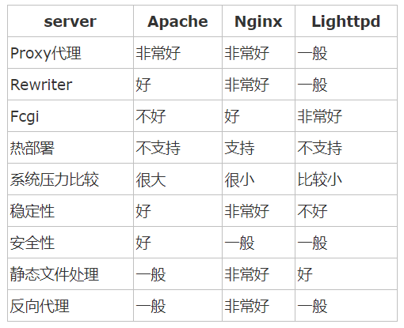

## Nginx

nginx [engine x]是最初由Igor Sysoev编写的HTTP和反向代理服务器，邮件代理服务器和通用TCP / UDP代理服务器

* 基本的HTTP服务器功能
* 其他HTTP服务器功能
* 邮件代理服务器功能
* TCP / UDP代理服务器功能
* 体系结构和可扩展性
* 经测试的操作系统和平台
以下是一些成功案例：Dropbox，Netflix，Wordpress.com，FastMail.FM。

nginx是一款自由的、开源的、高性能的HTTP服务器和反向代理服务器,同时也是一个IMAP、POP3、SMTP代理服务器,nginx可以作为一个HTTP服务器进行网站的发布处理，另外nginx可以作为反向代理进行负载均衡的实现。

---

## 什么是反向代理

全国各地的用户在淘宝客户端发出请求，经过了Nginx 反向代理服务器，nginx服务器接收到之后，按照一定的规则分发给了后端的业务处理服务器进行处理。

此时~请求的来源也就是客户端是明确的，但是请求具体由哪台服务器处理的并不明确了。Nginx扮演的就是一个反向代理角色。

总结下：反向代理，主要用于服务器集群分布式部署的情况下，反向代理隐藏了服务器的信息

## 什么是正向代理

举个例子：如今的网络环境下，我们如果由于技术需要要去访问国外的某些网站，此时你会发现位于国外的某网站我们通过浏览器是没有办法访问的，此时大家可能都会用一个操作FQ（VPN）进行访问，FQ的方式主要是找到一个可以访问国外网站的代理服务器，我们将请求发送给代理服务器，代理服务器去访问国外的网站，然后将访问到的数据传递给我

上述这样的代理模式称为正向代理.

正向代理最大的特点: 客户端非常明确要访问的服务器地址；服务器只清楚请求来自哪个代理服务器，而不清楚来自哪个具体的客户端；正向代理模式屏蔽或者隐藏了真实客户端信息。

---

## Nginx 如何实现负载均衡

上面客户端发送的、nginx反向代理服务器接收到的请求数量，就是我们说的负载量

什么又是均衡呢？

请求数量按照一定的规则进行分发到不同的服务器处理的规则，就是一种均衡规则

所以负载均衡就是：将服务器接收到的请求按照规则分发的过程

负载均衡在实际项目操作过程中，有硬件负载均衡和软件负载均衡两种

硬件负载均衡也称为硬负载，特点：造价昂贵成本较高，数据的稳定性安全性好。

更多的公司考虑到成本原因，会选择使用软件负载均衡，软件负载均衡是利用现有的技术结合主机硬件实现的一种消息队列分发机制

**nginx支持的负载均衡调度算法方式如下：**

* `weight轮询（默认）`：接收到的请求按照顺序逐一分配到不同的后端服务器，即使在使用过程中，某一台后端服务器宕机，nginx会自动将该服务器剔除出队列，请求受理情况不会受到任何影响。 这种方式下，可以给不同的后端服务器设置一个权重值（weight），用于调整不同的服务器上请求的分配率；权重数据越大，被分配到请求的几率越大；该权重值，主要是针对实际工作环境中不同的后端服务器硬件配置进行调整的。

* `ip_hash`：每个请求按照发起客户端的ip的hash结果进行匹配，这样的算法下一个固定ip地址的客户端总会访问到同一个后端服务器，这也在一定程度上解决了集群部署环境下session共享的问题。

* `fair`：智能调整调度算法，动态的根据后端服务器的请求处理到响应的时间进行均衡分配，响应时间短处理效率高的服务器分配到请求的概率高，响应时间长处理效率低的服务器分配到的请求少；结合了前两者的优点的一种调度算法。但是需要注意的是nginx默认不支持fair算法，如果要使用这种调度算法，请安装upstream_fair模块

* `url_hash`：按照访问的url的hash结果分配请求，每个请求的url会指向后端固定的某个服务器，可以在nginx作为静态服务器的情况下提高缓存效率。同样要注意nginx默认不支持这种调度算法，要使用的话需要安装nginx的hash软件包

---

## Nginx 另外一种实现负载均衡的方式

其实关于Nginx 实现负载均衡，除了上面那种模式外，还有一种Nginx处理静态资源实现负载均衡的架构。

我们先来看看原始的企业架构：

这种原始架构的特点：

* 单节点
* 几乎无容灾
* 负载能力低
* 维护简单
 
所以为了改善这种架构，引入了一种动静分离的模式：

这种架构模式，使用Nginx 来处理所有的html,js,css 静态资源请求，这样Tomcat 压力就会减轻一些，这样操作也能实现一定程度的负载均衡。

----
## Nginx是什么

Nginx是一款自由的、开源的、高性能的HTTP服务器和反向代理服务器；同时也是一个IMAP、POP3、SMTP代理服务器；Nginx可以作为一个HTTP服务器进行网站的发布处理，另外Nginx可以作为反向代理进行负载均衡的实现。

* Nginx使用基于事件驱动架构，使得其可以支持数以百万级别的TCP连接

* 高度的模块化和自由软件许可证是的第三方模块层出不穷（这是个开源的时代啊~）

* Nginx是一个跨平台服务器，可以运行在Linux,Windows,FreeBSD,Solaris, AIX,Mac OS等操作系统上

* 这些优秀的设计带来的极大的稳定性

### 正向代理
说反向代理之前，我们先看看正向代理，正向代理也是大家最常接触的到的代理模式，我们会从两个方面来说关于正向代理的处理模式，分别从软件方面和生活方面来解释一下什么叫正向代理。

在如今的网络环境下，我们如果由于技术需要要去访问国外的某些网站，此时你会发现位于国外的某网站我们通过浏览器是没有办法访问的，此时大家可能都会用一个操作FQ进行访问，FQ的方式主要是找到一个可以访问国外网站的代理服务器，我们将请求发送给代理服务器，代理服务器去访问国外的网站，然后将访问到的数据传递给我们！

上述这样的代理模式称为正向代理，正向代理最大的特点是客户端非常明确要访问的服务器地址；服务器只清楚请求来自哪个代理服务器，而不清楚来自哪个具体的客户端；正向代理模式屏蔽或者隐藏了真实客户端信息。来看个示意图（我把客户端和正向代理框在一块，同属于一个环境，后面我有介绍）：

`总结来说`：正向代理，"它代理的是客户端"，是一个位于客户端和原始服务器(origin server)之间的服务器，为了从原始服务器取得内容，客户端向代理发送一个请求并指定目标(原始服务器)，然后代理向原始服务器转交请求并将获得的内容返回给客户端。客户端必须要进行一些特别的设置才能使用正向代理。

正向代理的用途：
1. 访问原来无法访问的资源，如Google
2. 可以做缓存，加速访问资源
3. 对客户端访问授权，上网进行认证
4. 代理可以记录用户访问记录（上网行为管理），对外隐藏用户信息

### 反向代理

明白了什么是正向代理，我们继续看关于反向代理的处理方式，举例如我大天朝的某宝网站，每天同时连接到网站的访问人数已经爆表，单个服务器远远不能满足人民日益增长的购买欲望了，此时就出现了一个大家耳熟能详的名词：分布式部署；也就是通过部署多台服务器来解决访问人数限制的问题；某宝网站中大部分功能也是直接使用Nginx进行反向代理实现的，并且通过封装Nginx和其他的组件之后起了个高大上的名字：Tengine，有兴趣的童鞋可以访问Tengine的官网查看具体的信息：http://tengine.taobao.org/. 那么反向代理具体是通过什么样的方式实现的分布式的集群操作呢，我们先看一个示意图（我把服务器和反向代理框在一块，同属于一个环境，后面我有介绍）

通过上述的图解大家就可以看清楚了，多个客户端给服务器发送的请求，Nginx服务器接收到之后，按照一定的规则分发给了后端的业务处理服务器进行处理了。此时~请求的来源也就是客户端是明确的，但是请求具体由哪台服务器处理的并不明确了，Nginx扮演的就是一个反向代理角色。

客户端是无感知代理的存在的，反向代理对外都是透明的，访问者并不知道自己访问的是一个代理。因为客户端不需要任何配置就可以访问。

反向代理，"它代理的是服务端"，主要用于服务器集群分布式部署的情况下，反向代理隐藏了服务器的信息。

反向代理的作用：
1. 保证内网的安全，通常将反向代理作为公网访问地址，Web服务器是内网

2. 负载均衡，通过反向代理服务器来优化网站的负载

一张图来说明正向代理和反向代理二者之间的区别，如图。

在正向代理中，Proxy和Client同属于一个LAN（图中方框内），隐藏了客户端信息；

在反向代理中，Proxy和Server同属于一个LAN（图中方框内），隐藏了服务端信息；

实际上，Proxy在两种代理中做的事情都是替服务器代为收发请求和响应，不过从结构上看正好左右互换了一下，所以把后出现的那种代理方式称为反向代理了。

**Nginx支持的负载均衡调度算法方式如下：**

* `weight轮询(默认)`：接收到的请求按照顺序逐一分配到不同的后端服务器，即使在使用过程中，某一台后端服务器宕机，Nginx会自动将该服务器剔除出队列，请求受理情况不会受到任何影响。 这种方式下，可以给不同的后端服务器设置一个权重值(weight)，用于调整不同的服务器上请求的分配率；权重数据越大，被分配到请求的几率越大；该权重值，主要是针对实际工作环境中不同的后端服务器硬件配置进行调整的。

* `ip_hash`：每个请求按照发起客户端的ip的hash结果进行匹配，这样的算法下一个固定ip地址的客户端总会访问到同一个后端服务器，这也在一定程度上解决了集群部署环境下session共享的问题。

* `fair`：智能调整调度算法，动态的根据后端服务器的请求处理到响应的时间进行均衡分配，响应时间短处理效率高的服务器分配到请求的概率高，响应时间长处理效率低的服务器分配到的请求少；结合了前两者的优点的一种调度算法。但是需要注意的是Nginx默认不支持fair算法，如果要使用这种调度算法，请安装upstream_fair模块。

* `url_hash`：按照访问的url的hash结果分配请求，每个请求的url会指向后端固定的某个服务器，可以在Nginx作为静态服务器的情况下提高缓存效率。同样要注意Nginx默认不支持这种调度算法，要使用的话需要安装Nginx的hash软件包。

---

## NGINX可以用来做什么

1. 反向代理：反向代理（ReverseProxy）方式是指以代理服务器来接受internet上的连接请求，然后将请求转发给内部网络上的服务器，并将从服务器上得到的结果返回给internet上请求连接的客户端,简单来说就是真实的服务器不能直接被外部网络访问,想要访问必须通过代理。

2. 动静分离：运用Nginx的反向代理功能分发请求：所有动态资源的请求交给应用服务器，而静态资源的请求（例如图片、视频、CSS、JavaScript文件等）则直接由Nginx返回到浏览器，这样能大大减轻应用服务器的压力

3. 负载均衡：负载均衡也是 Nginx常用的一个功能，当一台服务器的单位时间内的访问量越大时，服务器压力就越大，大到超过自身承受能力时，服务器就会崩溃。为了避免服务器崩溃，让用户有更好的体验，我们通过负载均衡的方式来分担服务器压力。我们可以建立很多很多服务器，组成一个服务器集群，当用户访问网站时，先访问一个中间服务器，在让这个中间服务器在服务器集群中选择一个压力较小的服务器，然后将该访问请求引入该服务器。如此以来，用户的每次访问，都会保证服务器集群中的每个服务器压力趋于平衡，分担了服务器压力，避免了服务器崩溃的情况。负载均衡配置一般都需要同时配置反向代理，通过反向代理跳转到负载均衡。

#### 常见的几种负载均衡方式

1. 轮询（默认）——每个请求按时间顺序逐一分配到不同的后端服务器，如果后端服务器down掉，能自动剔除。

2. weight ——指定轮询几率，weight和访问比率成正比，用于后端服务器性能不均的情况。

3. ip_hash ——每个请求按访问ip的hash结果分配，这样每个访客固定访问一个后端服务器。

4. backup——其它所有的非backup机器down或者忙的时候，请求backup机器。所以这台机器压力会最轻。

5. down——表示单前的server暂时不参与负载

6. fair（第三方）按后端服务器的响应时间来分配请求，响应时间短的优先分配。与weight分配策略类似。
